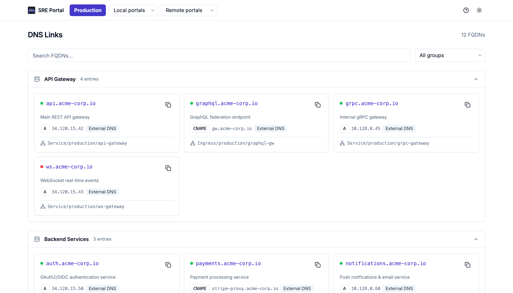
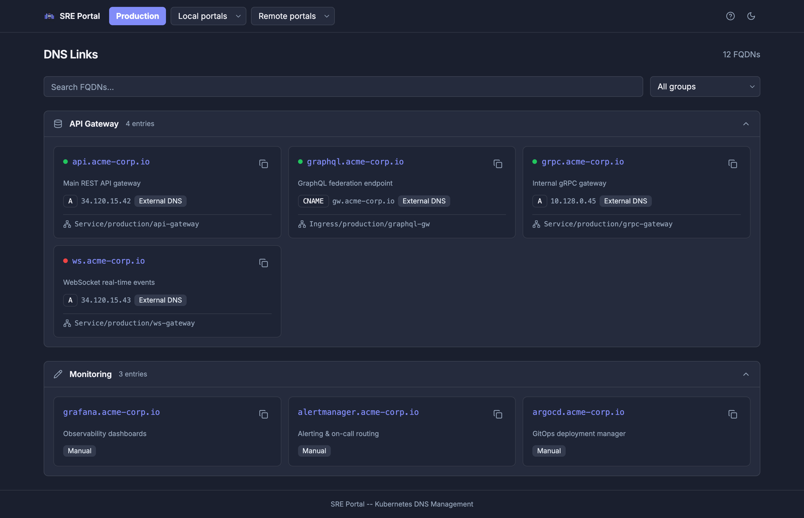
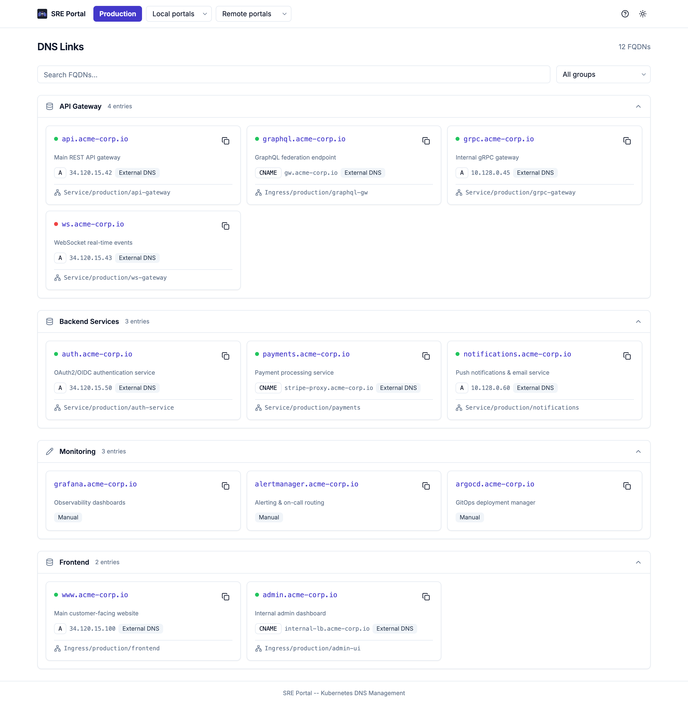

# SRE Portal: A Kubernetes-Native DNS Discovery Dashboard for Platform Teams

*Stop losing track of your endpoints. SRE Portal is an open-source Kubernetes operator that automatically discovers DNS records from your cluster resources and presents them in a clean, searchable web dashboard.*



---

## The Problem: DNS Sprawl in Kubernetes

If you're running a Kubernetes platform with dozens (or hundreds) of services, you've probably felt this pain: **nobody knows what endpoints exist, where they point, or whether they're still alive.**

Services get deployed, Ingresses are created, external-dns generates records, teams add manual entries... and before you know it, your DNS landscape looks like a digital junkyard. The new engineer on your team asks "what's the URL for the payment service?" and everyone starts digging through Confluence pages, Slack threads, or Terraform outputs.

As an SRE team lead managing GKE clusters, I faced this daily. Our platform had grown to multiple clusters across regions, each with its own set of services, ingresses, and DNS endpoints. We needed a **single pane of glass** — not another wiki page that goes stale in a week, but something that discovers endpoints automatically and stays in sync with reality.

That's why I built **SRE Portal**.

## What is SRE Portal?

SRE Portal is a **Kubernetes operator** that runs as a single container in your cluster. It does three things:

1. **Discovers** DNS records from your Kubernetes resources (Services, Ingresses, Istio Gateways, DNSEndpoints)
2. **Aggregates** them with manual entries you define via Custom Resources
3. **Serves** a modern web dashboard where your team can search, filter, and browse all endpoints

Think of it as a combination of [external-dns](https://github.com/kubernetes-sigs/external-dns) awareness and a developer portal for DNS — but without the complexity of a full service catalog like Backstage.

### Key Features

- **Automatic DNS discovery** — Picks up endpoints from Services, Ingresses, Istio Gateways, and external-dns DNSEndpoints across all namespaces
- **Portal routing** — Organize endpoints into multiple portals using a simple annotation (`sreportal.io/portal`)
- **Flexible grouping** — Group FQDNs by annotation, label, namespace, or custom rules
- **Multi-cluster federation** — Connect remote SRE Portal instances to get a unified view across clusters
- **DNS sync status** — Visual indicator showing whether DNS records are actually resolving
- **Built-in MCP server** — Integrate with AI assistants (Claude, Cursor) for natural-language DNS queries
- **Single container** — Controller, gRPC API, web UI, and MCP server all packaged together
- **Light & dark theme** — Because SREs work at all hours



## Quick Start: 5 Minutes to Your First Portal

### Prerequisites

- A Kubernetes cluster (v1.28+)
- `kubectl` and Helm 3+

### 1. Install with Helm

```bash
helm install sreportal oci://ghcr.io/golgoth31/charts/sreportal \
  --namespace sreportal-system --create-namespace
```

That's it. The operator will create a default "main" portal automatically.

### 2. Access the Dashboard

```bash
kubectl port-forward -n sreportal-system svc/sreportal-controller-manager 8082:8082
```

Open [http://localhost:8082](http://localhost:8082) — you should see the empty dashboard, ready to be populated.

### 3. Annotate a Service

If your services already use `external-dns`, SRE Portal picks them up automatically. Just add the portal annotation:

```yaml
apiVersion: v1
kind: Service
metadata:
  name: api-gateway
  namespace: production
  annotations:
    external-dns.alpha.kubernetes.io/hostname: "api.acme-corp.io"
    sreportal.io/portal: "main"
    sreportal.io/groups: "API Gateway"
spec:
  type: LoadBalancer
  ports:
    - port: 443
      targetPort: 8080
```

Within seconds, `api.acme-corp.io` appears in your dashboard under the "API Gateway" group, with its record type, target IP, and a link back to the originating Kubernetes resource.

### 4. Add Manual Entries

Not everything lives in Kubernetes. For external tools like Grafana, ArgoCD, or third-party SaaS endpoints, use a `DNS` Custom Resource:

```yaml
apiVersion: sreportal.io/v1alpha1
kind: DNS
metadata:
  name: monitoring-tools
  namespace: sreportal-system
spec:
  portalRef: main
  groups:
    - name: Monitoring
      description: Observability and alerting tools
      entries:
        - fqdn: grafana.acme-corp.io
          description: Observability dashboards
        - fqdn: alertmanager.acme-corp.io
          description: Alerting & on-call routing
        - fqdn: argocd.acme-corp.io
          description: GitOps deployment manager
```

Manual and auto-discovered entries coexist in the same dashboard. The UI clearly distinguishes them with source badges ("External DNS" vs "Manual") and different group icons.

## How It Works Under the Hood

SRE Portal is built on three Custom Resource Definitions (CRDs) that work together:

```
┌─────────────────────────────────────────────────────────────┐
│                     SRE Portal Pod                          │
│                                                             │
│  ┌───────────────┐  ┌──────────────┐  ┌──────────────────┐ │
│  │  Controllers   │  │ Connect API  │  │  Web UI + MCP    │ │
│  │(ctrl-runtime)  │  │ (gRPC/h2c)   │  │  (Echo v5)       │ │
│  └───────┬───────┘  └──────┬───────┘  └────────┬─────────┘ │
│          │                 │                    │           │
│          └────────┬────────┴──────────┬─────────┘           │
│                   │                   │                     │
│            K8s API Server       MCP Server (/mcp)           │
└─────────────────────────────────────────────────────────────┘
```

| CRD | Role |
|-----|------|
| **Portal** | Named view for the web dashboard. Can be local or remote (federation). |
| **DNS** | Manual DNS entry groups linked to a portal. |
| **DNSRecord** | Auto-discovered endpoints, managed entirely by the operator. |

### The Reconciliation Chain

The DNS controller uses a **Chain of Responsibility** pattern with four steps:

1. **Aggregate DNSRecords** — Fetch all auto-discovered records for the portal
2. **Collect Manual Entries** — Extract entries from DNS custom resources
3. **Aggregate FQDNs** — Merge both sources (manual entries win on conflict)
4. **Update Status** — Write the final aggregated list to the DNS status

This design makes the reconciliation **idempotent** — you can restart the controller at any time without side effects. Each step is an independent handler that can be tested in isolation.

### Annotation-Driven Routing

The key annotation is `sreportal.io/portal`. When a Kubernetes resource (Service, Ingress, etc.) has the standard `external-dns` hostname annotation, SRE Portal's source controller picks it up and routes it to the right portal:

```yaml
annotations:
  external-dns.alpha.kubernetes.io/hostname: "api.example.com"
  sreportal.io/portal: "production"       # Routes to "production" portal
  sreportal.io/groups: "Backend,APIs"     # Assigns to multiple groups
```

If no portal annotation is set, the endpoint goes to the **main** portal (the default one). You can also use `sreportal.io/ignore: "true"` to exclude a resource entirely.

## Multi-Cluster Federation

In a real-world platform, services span multiple clusters. SRE Portal handles this with **remote portals** — a Portal that syncs DNS data from another SRE Portal instance:

```yaml
apiVersion: sreportal.io/v1alpha1
kind: Portal
metadata:
  name: eu-west
  namespace: sreportal-system
spec:
  title: "EU West Cluster"
  remote:
    url: "https://sreportal.eu-west.internal:8082"
    tls:
      caSecretRef:
        name: eu-west-ca
```

The local portal fetches FQDNs from the remote instance every 5 minutes and displays them alongside local entries. The web UI shows remote portals in a separate dropdown, and each can link directly to the remote portal's own dashboard.

This creates a **hub-and-spoke model**: one central SRE Portal aggregates data from satellite clusters, giving your team a unified view without complex networking.

## The Web Dashboard

The dashboard is a React 19 SPA built with Tailwind CSS and shadcn/ui components. It's designed for the daily workflow of an SRE or platform engineer.



### What You See

Each FQDN card shows:

- **Sync status dot** — Green if DNS resolves correctly, red if not. This gives you an instant health check.
- **Clickable FQDN** — Opens the endpoint in a new tab. Because sometimes you just need to check if it loads.
- **Copy button** — One click to copy the FQDN to clipboard. Small detail, big time saver.
- **Record type & targets** — A/AAAA/CNAME with the actual IP or hostname.
- **Source badge** — "External DNS" or "Manual" so you know where the entry came from.
- **Origin reference** — Links back to the Kubernetes resource (e.g., `Service/production/api-gateway`), so you can trace any endpoint to its source.

### Search & Filters

The top bar provides:
- **Full-text search** across FQDN names and descriptions
- **Group filter** dropdown to focus on a specific group
- **FQDN count** showing filtered vs total results
- Active filter badges with individual clear buttons

All filtering happens client-side for instant feedback. The data refreshes automatically every 5 seconds via polling.

## AI Integration with MCP

One of SRE Portal's unique features is its built-in **Model Context Protocol (MCP)** server. This exposes your DNS data to AI assistants like Claude Desktop, Claude Code, or Cursor.

The MCP server provides three tools:

| Tool | Description |
|------|-------------|
| `search_fqdns` | Search FQDNs by query, source, group, portal, or namespace |
| `list_portals` | List all available portals |
| `get_fqdn_details` | Get full details for a specific FQDN |

### Setting It Up

**Claude Code:**
```bash
claude mcp add sreportal --transport http http://sreportal.internal:8082/mcp
```

**Claude Desktop** (`claude_desktop_config.json`):
```json
{
  "mcpServers": {
    "sreportal": {
      "url": "http://sreportal.internal:8082/mcp"
    }
  }
}
```

Once connected, you can ask your AI assistant questions like:

> "What's the FQDN for the payment service in production?"

> "Show me all DNS entries in the API Gateway group"

> "Is the auth service DNS record in sync?"

The assistant queries SRE Portal's MCP server and gives you an answer in natural language — no dashboard switching required. The `/help` page in the web UI provides copy-paste setup instructions for each supported client.

## How Does It Compare?

SRE Portal occupies a specific niche. Here's how it relates to other tools:

| Tool | Focus | SRE Portal Difference |
|------|-------|-----------------------|
| **Gatus** | Health checks & status page | SRE Portal focuses on DNS discovery, not health probing (yet) |
| **Uptime Kuma** | Uptime monitoring | SRE Portal is Kubernetes-native with CRDs, not a standalone monitor |
| **Backstage** | Full developer portal | SRE Portal is lightweight and focused — no plugin ecosystem to manage |
| **external-dns** | DNS record management | SRE Portal reads from external-dns sources but adds a UI + aggregation layer |
| **Cachet** | Status pages | SRE Portal discovers endpoints automatically instead of manual status updates |

If you need a **lightweight, Kubernetes-native tool** that answers "what endpoints do we have and are they working?", SRE Portal fits that gap. If you need a full developer portal with service catalog, CI/CD integration, and a plugin marketplace, look at Backstage.

## Configuration

SRE Portal is configured via a ConfigMap in the operator namespace. Here's an example:

```yaml
apiVersion: v1
kind: ConfigMap
metadata:
  name: sreportal-config
  namespace: sreportal-system
data:
  config.yaml: |
    sources:
      service: true
      ingress: true
      dnsEndpoint: true
      istioGateway: false
    groupMapping:
      defaultGroup: "Ungrouped"
      labelKey: "app.kubernetes.io/part-of"
      byNamespace:
        production: "Production Services"
        staging: "Staging Services"
        monitoring: "Monitoring"
    reconciliation:
      interval: 5m
```

This lets you:
- Toggle which Kubernetes resource types are scanned
- Define default grouping rules (by label, by namespace, or a static default)
- Control how often the source controller reconciles

## What's Next

SRE Portal is under active development. The roadmap includes:

- **Component CRD** — Health monitoring with HTTP, gRPC, Kubernetes, and Prometheus checks
- **Incident CRD** — Incident tracking with status updates and severity levels
- **Maintenance CRD** — Scheduled maintenance windows
- **Status pages** — Public-facing status pages generated from Component health data

The vision is a complete **Kubernetes-native status page and service catalog** that stays in sync with your cluster — no manual updates required.

## Get Started

SRE Portal is open source under the Apache 2.0 license.

```bash
# Install
helm install sreportal oci://ghcr.io/golgoth31/charts/sreportal \
  --namespace sreportal-system --create-namespace

# Access
kubectl port-forward -n sreportal-system svc/sreportal-controller-manager 8082:8082
```

- **GitHub**: [github.com/golgoth31/sreportal](https://github.com/golgoth31/sreportal)
- **Documentation**: [golgoth31.github.io/sreportal](https://golgoth31.github.io/sreportal/)

If you run a Kubernetes platform and are tired of maintaining a spreadsheet of DNS endpoints, give SRE Portal a try. Feedback, issues, and contributions are welcome.

---

*SRE Portal is built with Go, Kubebuilder, React 19, Tailwind CSS, Connect protocol, and external-dns. It runs as a single container and requires no external dependencies beyond a Kubernetes cluster.*
