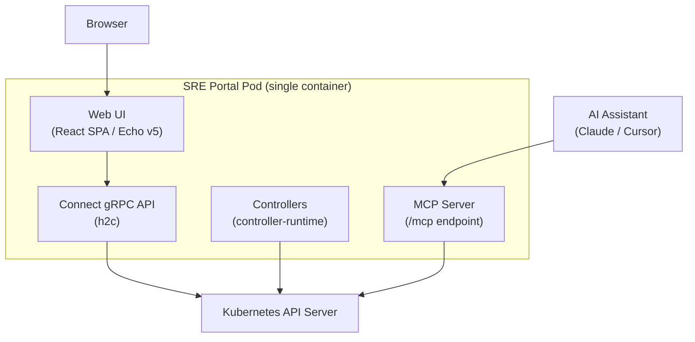
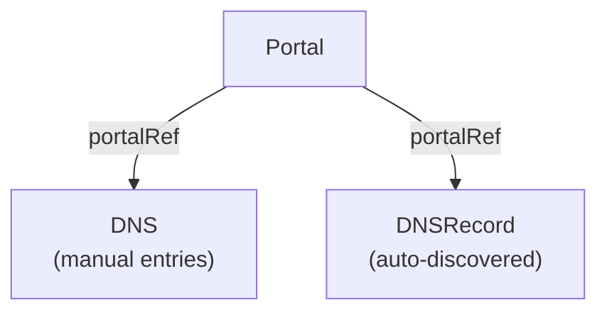
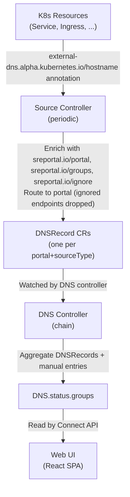

SRE Portal runs as a single container that combines a Kubernetes controller, a gRPC/Connect API, and a web UI server.

## High-Level Overview

The four components share the same process:

- **Controllers** reconcile CRDs using controller-runtime
- **Connect API** serves gRPC-compatible endpoints over HTTP/2 (h2c)
- **Web UI** serves the React SPA as static files via Echo v5
- **MCP Server** exposes a [Model Context Protocol](https://modelcontextprotocol.io/) endpoint at `/mcp` for AI assistant integration

## Custom Resource Definitions

SRE Portal defines three CRDs that work together:

### Portal

Defines a named web dashboard view. Each portal has a title, an optional subpath, and a `main` flag. The operator creates a default `main` portal on startup.

A portal can optionally set `spec.remote` to fetch DNS data from a remote SRE Portal instance instead of collecting it locally. Remote portals are periodically synchronized (every 5 minutes) and their FQDNs appear with source `remote` in the DNS status.

### DNS

Contains manually defined DNS entry groups linked to a portal via `spec.portalRef`. The DNS controller aggregates these manual entries with auto-discovered endpoints into `status.groups`.

### DNSRecord

Created and managed automatically by the source controller. Each DNSRecord represents endpoints discovered from a specific source type (Service, Ingress, etc.) for a specific portal.

## Design Principles

### Domain-Driven Design (DDD)

Domain logic lives in `internal/domain/` with no external dependencies. Infrastructure concerns (Kubernetes API, gRPC, HTTP) are isolated in adapters and controllers.

### Clean Architecture

Dependencies point inward: controllers depend on the domain layer, but the domain never imports controller or infrastructure packages.

### Idempotent Reconciliation

All controllers are safe to run multiple times. They compute desired state from the current state and converge toward it without side effects from repeated runs.

## Controllers

### DNS Controller (Chain of Responsibility)

The DNS controller uses a generic Chain-of-Responsibility framework (`internal/reconciler/handler.go`) that executes handlers sequentially, short-circuiting on error or requeue.

The chain has four steps:

| Step | Handler | Description |
|------|---------|-------------|
| 1 | **AggregateDNSRecords** | Fetch DNSRecord resources that match the portal via `spec.portalRef` and convert their endpoints to FQDN groups |
| 2 | **CollectManualEntries** | Extract manual groups from `DNS.spec.groups` |
| 3 | **AggregateFQDNs** | Merge external-dns groups with manual groups (manual entries win on conflict) |
| 4 | **UpdateStatus** | Write the aggregated groups to `DNS.status` |

### Source Controller (Runnable)

The source controller implements `manager.Runnable` for periodic reconciliation (default: 5 minutes). On each tick it:

1. Builds external-dns sources (Service, Ingress, DNSEndpoint, Istio Gateway, Istio VirtualService) based on operator configuration
2. Fetches endpoints from each source
3. Enriches endpoints with `sreportal.io/portal`, `sreportal.io/groups`, and `sreportal.io/ignore` annotations from the original K8s resources
4. Routes endpoints to the appropriate portal (falls back to the main portal if the annotation is missing or references a non-existent portal)
5. Creates or updates a DNSRecord CR per `(portal, sourceType)` pair

### Portal Controller

A simple controller that sets `status.ready = true` with a `Ready` condition. It also runs an `EnsureMainPortalRunnable` that creates the default `main` portal on startup if none exists.

## Connect API

The API uses the [Connect protocol](https://connectrpc.com) (gRPC-compatible over HTTP/1.1 and HTTP/2) with protobuf definitions in `proto/sreportal/v1/`.

### DNSService

| RPC | Description |
|-----|-------------|
| `ListFQDNs` | Lists all FQDNs with optional filters (namespace, source, search, portal) |
| `StreamFQDNs` | Server-streaming RPC that pushes FQDN updates (polls every 5s) |

### PortalService

| RPC | Description |
|-----|-------------|
| `ListPortals` | Lists all portals |

## MCP Server

The operator includes a built-in [Model Context Protocol](https://modelcontextprotocol.io/) (MCP) server mounted at `/mcp` on the web server port. It exposes three tools for AI assistants (Claude Desktop, Claude Code, Cursor):

| Tool | Description |
|------|-------------|
| `search_fqdns` | Search FQDNs by query, source, group, portal, or namespace |
| `list_portals` | List all available portals |
| `get_fqdn_details` | Get detailed information about a specific FQDN |

The MCP server uses Streamable HTTP transport and reads the same DNS status data as the Connect API.

## Data Flow

The complete flow from Kubernetes resource to web dashboard:

## Owner References

DNSRecord resources are managed by the source controller with Kubernetes owner references, enabling automatic garbage collection when a portal is deleted.
