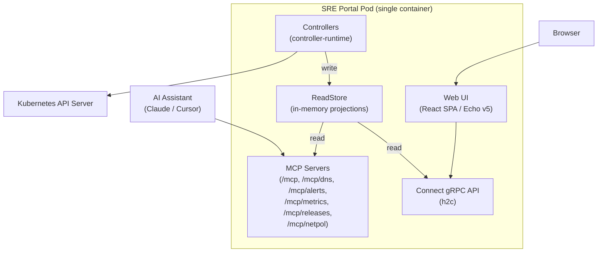
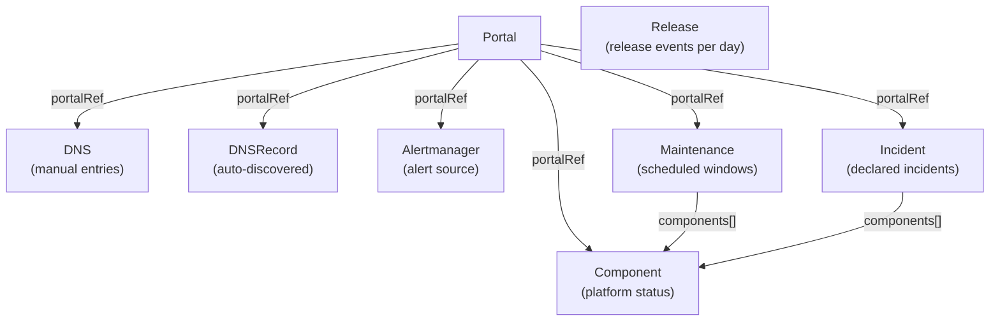
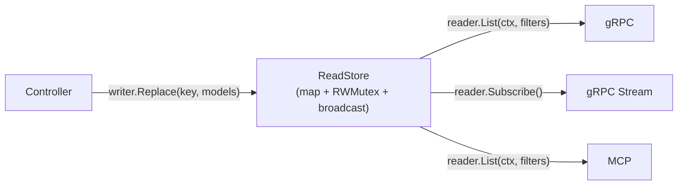
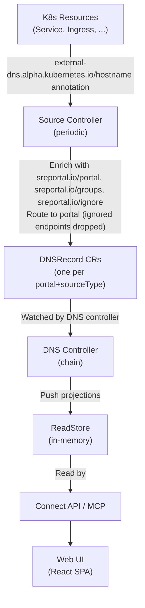

SRE Portal runs as a single container that combines a Kubernetes controller, a gRPC/Connect API, and a web UI server.

## High-Level Overview

The six components share the same process:

- **Controllers** reconcile CRDs using controller-runtime and push projections into the ReadStore
- **ReadStore** holds pre-aggregated read models in-memory, decoupling reads from the Kubernetes API
- **Connect API** serves gRPC-compatible endpoints over HTTP/2 (h2c), reading from the ReadStore
- **Web UI** serves the React SPA as static files via Echo v5
- **MCP Servers** expose [Model Context Protocol](https://modelcontextprotocol.io/) at `/mcp` and `/mcp/dns` (DNS/portals), `/mcp/alerts` (alerts), `/mcp/metrics` (Prometheus metrics), `/mcp/releases` (release tracking), `/mcp/netpol` (network flows), and `/mcp/status` (status page) for AI assistant integration

## Custom Resource Definitions

SRE Portal defines eight CRDs that work together:

### Portal

Defines a named web dashboard view. Each portal has a title, an optional subpath, and a `main` flag. The operator creates a default `main` portal on startup.

A portal can optionally set `spec.remote` to fetch DNS data from a remote SRE Portal instance instead of collecting it locally. Remote portals are periodically synchronized (every 5 minutes) and their FQDNs appear with source `remote` in the DNS status.

### DNS

Contains manually defined DNS entry groups linked to a portal via `spec.portalRef`. The DNS controller aggregates these manual entries with auto-discovered endpoints into `status.groups`.

### DNSRecord

Created and managed automatically by the source controller. Each DNSRecord represents endpoints discovered from a specific source type (Service, Ingress, etc.) for a specific portal.

### Alertmanager

Links an Alertmanager instance to a portal via `spec.portalRef`. The spec defines `url.local` (used by the controller to fetch active alerts from the Alertmanager API) and optional `url.remote` (for dashboard links). The Alertmanager controller periodically fetches alerts and stores them in `status.activeAlerts`.

### Release

Stores release events (deployments, rollbacks, hotfixes, feature flags, etc.) organized by day. Each Release CR is named `release-YYYY-MM-DD` and holds an array of entries with type, version, origin, date, and optional author, message, and link fields. Release CRs are not linked to a portal — they are global and shown on the main portal's Releases page.

The Release controller automatically deletes CRs older than the configured TTL (default: 30 days).

### Component

Represents a monitored platform component (e.g., GKE cluster, Cloud SQL, API Gateway) linked to a portal via `spec.portalRef`. The user declares the operational status in `spec.status` (`operational`, `degraded`, `partial_outage`, `major_outage`, `unknown`). The controller computes `status.computedStatus`, which may be overridden to `maintenance` when an active Maintenance targets this component.

### Maintenance

Represents a scheduled maintenance window linked to a portal. The spec defines `scheduledStart`, `scheduledEnd`, a list of affected `components[]`, and the `affectedStatus` to apply during the window. The controller automatically computes the phase (`upcoming` → `in_progress` → `completed`) and uses strategic `RequeueAfter` to transition at the exact scheduled times.

### Incident

Represents a declared incident linked to a portal. The spec contains `severity` (`critical`, `major`, `minor`), affected `components[]`, and a timeline of `updates[]` appended via `kubectl edit/patch`. The controller derives `status.currentPhase` from the latest update, and computes `startedAt`, `resolvedAt`, and `durationMinutes` when resolved.

## Design Principles

### Domain-Driven Design (DDD)

Domain logic lives in `internal/domain/` with no external dependencies. Infrastructure concerns (Kubernetes API, gRPC, HTTP) are isolated in adapters and controllers.

### Clean Architecture

Dependencies point inward: controllers depend on the domain layer, but the domain never imports controller or infrastructure packages.

### Idempotent Reconciliation

All controllers are safe to run multiple times. They compute desired state from the current state and converge toward it without side effects from repeated runs.

## ReadStore (CQRS Read Path)

All gRPC and MCP services read from in-memory **ReadStores** instead of querying the Kubernetes API directly. Controllers write projections into these stores during reconciliation.

Each bounded context has its own domain interfaces (`internal/domain/<ctx>/reader.go`, `writer.go`) and store implementation (`internal/readstore/<ctx>/`), backed by a shared generic `readstore.Store[T]`.

| Context | Store | Key | Reader | Writer |
|---------|-------|-----|--------|--------|
| DNS | `FQDNStore` | DNS CR resource key | `FQDNReader` | `FQDNWriter` |
| Portal | `PortalStore` | Portal resource key | `PortalReader` | `PortalWriter` |
| Alertmanager | `AlertmanagerStore` | Alertmanager resource key | `AlertmanagerReader` | `AlertmanagerWriter` |
| Network Policy | `FlowGraphStore` | NFD name (dual node/edge stores + portalRef mapping) | `FlowGraphReader` | `FlowGraphWriter` |
| Release | `ReleaseStore` | Day string (`2026-03-25`) | `ReleaseReader` | `ReleaseWriter` |
| Component | `ComponentStore` | Component resource key | `ComponentReader` | `ComponentWriter` |
| Maintenance | `MaintenanceStore` | Maintenance resource key | `MaintenanceReader` | `MaintenanceWriter` |
| Incident | `IncidentStore` | Incident resource key | `IncidentReader` | `IncidentWriter` |

Mutations broadcast to subscribers via a channel-close pattern, enabling event-driven streams (e.g. `StreamFQDNs`) without polling.

## Controllers

### DNS Controller (Chain of Responsibility)

The DNS controller uses a generic Chain-of-Responsibility framework (`internal/reconciler/handler.go`) that executes handlers sequentially, short-circuiting on error or requeue.

The chain has four steps:

| Step | Handler | Description |
|------|---------|-------------|
| 1 | **CollectManualEntries** | Extract manual groups from `DNS.spec.groups` |
| 2 | **AggregateFQDNs** | Convert to FQDNGroupStatus with source markers, sort by name |
| 3 | **ResolveDNS** | Parallel DNS lookup per FQDN (10 workers, 5s timeout). Skipped if `disableDNSCheck: true` |
| 4 | **UpdateStatus** | Write the aggregated groups to `DNS.status` and project to the ReadStore |

See the [DNS Controller Flow]() for a detailed step-by-step diagram.

### Source Controller (Chain of Responsibility, Runnable)

The source controller implements `manager.Runnable` for periodic reconciliation (configurable interval). It uses the same Chain-of-Responsibility pattern as the DNS and Alertmanager controllers, with six sequential handlers:

| Step | Handler | Description |
|------|---------|-------------|
| 1 | **RebuildSources** | Build external-dns sources from operator config (lazy — only if none exist) |
| 2 | **BuildPortalIndex** | List Portal CRs and build a name→portal lookup index |
| 3 | **CollectEndpoints** | Fetch endpoints from each source, enrich with `sreportal.io/*` annotations, route to (portal, sourceType) buckets |
| 4 | **Deduplicate** | Remove duplicate FQDNs across source types using configured `sources.priority` order |
| 5 | **ReconcileDNSRecords** | Create or update a DNSRecord CR per (portal, sourceType) pair. Computes SHA-256 hash of endpoints and skips status writes when unchanged |
| 6 | **DeleteOrphaned** | Delete DNSRecord CRs for disabled sources or portals with no endpoints |

See the [DNS Source Flow]() for a detailed step-by-step diagram.

### Portal Controller

A simple controller that sets `status.ready = true` with a `Ready` condition. It also runs an `EnsureMainPortalRunnable` that creates the default `main` portal on startup if none exists.

### Alertmanager Controller (Chain)

Uses the same Chain-of-Responsibility pattern as the DNS controller. The chain has two steps: **FetchAlerts** (HTTP GET to `spec.url.local`, Alertmanager API v2) and **UpdateStatus** (write `activeAlerts`, conditions, `lastReconcileTime` to status). Reconciles periodically (default ~2 minutes). See the [Alertmanager Flow]() for details.

### Release Controller (ReadStore + TTL Cleanup)

The Release controller watches Release CRs and performs two duties:

1. **ReadStore projection**: converts Release CR entries to domain read models and pushes them to the ReadStore. External modifications (e.g. `kubectl edit`, CI pipelines) are detected immediately via the watch.

2. **TTL cleanup**: checks whether the CR's day is older than the configured TTL (default: 30 days). Expired CRs are automatically deleted. Each CR is re-checked every 12 hours via `RequeueAfter`.

### Component Controller (Chain)

Uses the Chain-of-Responsibility pattern with three steps: **ValidatePortalRef** (verify Portal exists), **ComputeStatus** (read MaintenanceReader for active maintenance override), **UpdateStatus** (patch computedStatus, label, project to ReadStore). Also watches Maintenance CRs to re-enqueue affected components. See the [Component Flow]() for details.

### Maintenance Controller (Chain)

Uses two chain steps: **ComputePhase** (upcoming/in_progress/completed from current time) and **UpdateStatus** (patch phase, project to ReadStore, set strategic RequeueAfter). No fixed polling — requeues at exact transition times (`scheduledStart`, `scheduledEnd`). See the [Maintenance Flow]() for details.

### Incident Controller (Chain)

Uses two chain steps: **ComputeStatus** (derive currentPhase from latest update, compute duration if resolved) and **UpdateStatus** (patch status fields, project to ReadStore). Uses the domain function `incident.ComputeStatus()` for all phase/duration computation.

## Connect API

The API uses the [Connect protocol](https://connectrpc.com) (gRPC-compatible over HTTP/1.1 and HTTP/2) with protobuf definitions in `proto/sreportal/v1/`.

All Connect handlers share a unary interceptor (`internal/grpc/interceptor.go`) that logs handler errors at **WARN** level. Connect often returns HTTP 200 even when the RPC fails with a coded error, so this makes failures visible in logs alongside the HTTP access log.

### DNSService

| RPC | Description |
|-----|-------------|
| `ListFQDNs` | Lists all FQDNs with optional filters (namespace, source, search, portal) |
| `StreamFQDNs` | Server-streaming RPC that pushes FQDN updates (polls every 5s) |

### PortalService

| RPC | Description |
|-----|-------------|
| `ListPortals` | Lists all portals |

### AlertmanagerService

| RPC | Description |
|-----|-------------|
| `ListAlerts` | Lists Alertmanager resources with active alerts (filters: portal, namespace, search, state) |

### ReleaseService

| RPC | Description |
|-----|-------------|
| `AddRelease` | Append a release entry to the day’s Release CR (type validated against configured allowlist when `release.types` is set) |
| `ListReleases` | List release entries for a day (pagination within the day; `previous_day` / `next_day` for adjacent days with data) |
| `ListReleaseDays` | Return all days that have Release CRs and the TTL window (`ttl_days`) for the UI |

### StatusService

| RPC | Description |
|-----|-------------|
| `ListComponents` | Lists platform components with status (filters: `portal_ref`, `group`) |
| `ListMaintenances` | Lists maintenance windows (filters: `portal_ref`, `phase`) |
| `ListIncidents` | Lists incidents (filters: `portal_ref`, `phase`) |

### VersionService

| RPC | Description |
|-----|-------------|
| `GetVersion` | Return build metadata (`version`, `commit`, `date`) |

### MetricsService

| RPC | Description |
|-----|-------------|
| `ListMetrics` | List Prometheus metrics from the operator's metrics registry |

## MCP Servers

The operator includes five built-in [Model Context Protocol](https://modelcontextprotocol.io/) (MCP) servers on the web server port, using Streamable HTTP transport:

**DNS / Portals** (mounted at `/mcp` and `/mcp/dns`; `/mcp` is kept for backward compatibility):

| Tool | Description |
|------|-------------|
| `search_fqdns` | Search FQDNs by query, source, group, portal, or namespace |
| `list_portals` | List all available portals |
| `get_fqdn_details` | Get detailed information about a specific FQDN |

**Alerts** (mounted at `/mcp/alerts`):

| Tool | Description |
|------|-------------|
| `list_alerts` | List Alertmanager resources and their active alerts (optional filters: portal, search, state) |

**Metrics** (mounted at `/mcp/metrics`):

| Tool | Description |
|------|-------------|
| `list_metrics` | List Prometheus metrics from the operator's metrics registry |

**Releases** (mounted at `/mcp/releases`):

| Tool | Description |
|------|-------------|
| `list_releases` | List release entries for a day (`previous_day` / `next_day` in the result) |

**Network Policies** (mounted at `/mcp/netpol`):

| Tool | Description |
|------|-------------|
| `list_network_flows` | List network flow nodes and edges (optional filters: portal, namespace, search with 1-hop expansion) |
| `get_service_flows` | Get all incoming and outgoing flows for a specific service |

**Status Page** (mounted at `/mcp/status`):

| Tool | Description |
|------|-------------|
| `list_components` | List platform components with operational status (filters: portal, group) |
| `list_maintenances` | List maintenance windows (filters: portal, phase) |
| `list_incidents` | List incidents (filters: portal, phase) |
| `get_platform_status` | Aggregated platform health summary with status counts |

## Data Flow

The complete flow from Kubernetes resource to web dashboard:

## Owner References

DNSRecord resources are managed by the source controller with Kubernetes owner references, enabling automatic garbage collection when a portal is deleted.
