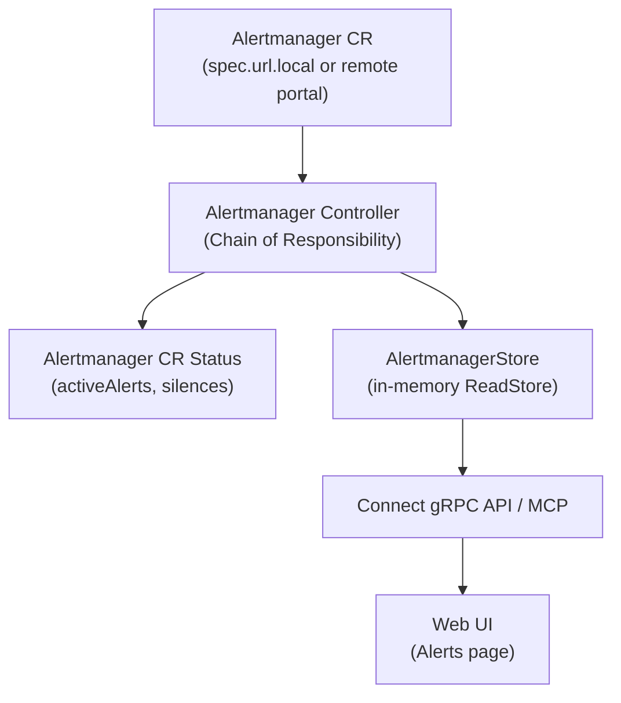
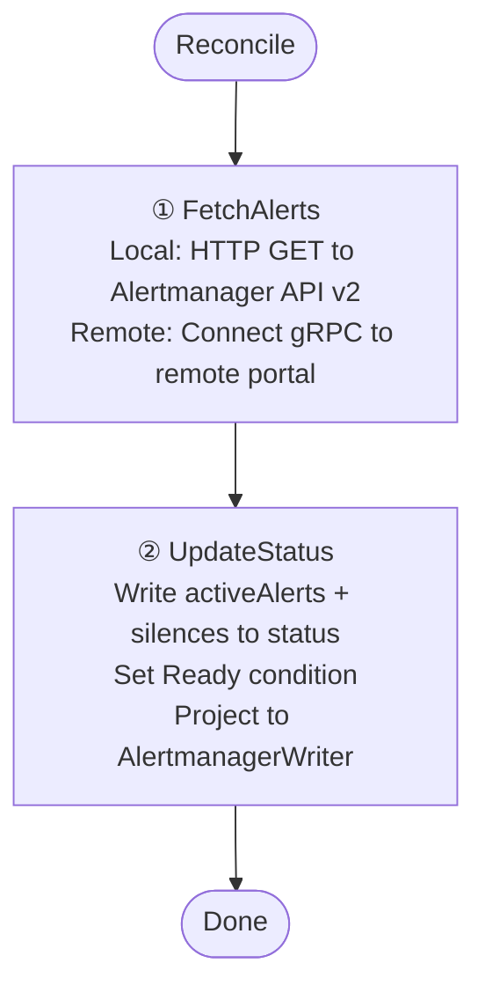
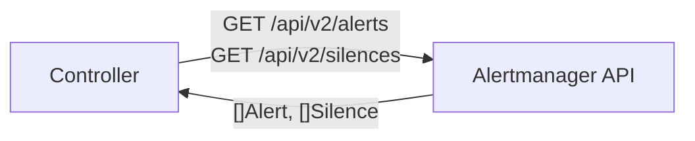
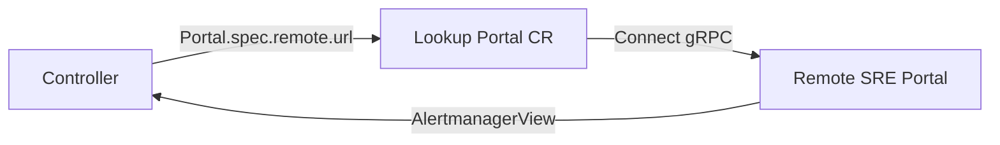

The Alertmanager controller fetches active alerts and silences from Alertmanager instances and projects them into the ReadStore.

## Overview



## Trigger

**Watch-based**: triggers on create/update/delete of `Alertmanager` CRs. Requeues every **2 minutes** (even on success) for periodic alert refresh.

## Chain of Responsibility



### Step 1 — FetchAlerts

Two paths depending on whether the Alertmanager instance is local or remote:

**Local Alertmanager** (`spec.url.local` is set):



Uses the Alertmanager v2 HTTP API. Fetches both active alerts and silences in a single data call when available, otherwise falls back to alerts-only.

**Remote Alertmanager** (linked to a remote portal):



Resolves the portal's remote URL, uses a cached TLS client, and fetches alerts via the remote portal's Connect API.

### Step 2 — UpdateStatus

1. Converts domain `Alert` and `Silence` objects to CRD status types
2. Patches `status.activeAlerts`, `status.silences`, `status.lastReconcileTime`
3. Sets `Ready` condition (True on success, False with fetch error details)
4. **Projects to ReadStore**: writes `AlertmanagerView` to the AlertmanagerWriter

On CR deletion, the controller removes the corresponding key from the AlertmanagerWriter.

## Domain Types

```
Alertmanager API v2 Response
     │
     ▼
domainalertmanager.Alert {
    Fingerprint, Labels, Annotations,
    State (active/suppressed/unprocessed),
    StartsAt, UpdatedAt, EndsAt,
    Receivers, SilencedBy
}
     │
     ▼
sreportalv1alpha1.AlertStatus  (K8s CR in etcd)
     │
     ▼
AlertmanagerView               (ReadStore, in-memory)
     │
     ▼
proto AlertmanagerAlert        (on the wire)
```

## Metrics

- `sreportal_alerts_active` (by portal, alertmanager name): number of active alerts
- `sreportal_alerts_fetch_errors_total`: counter of fetch failures
