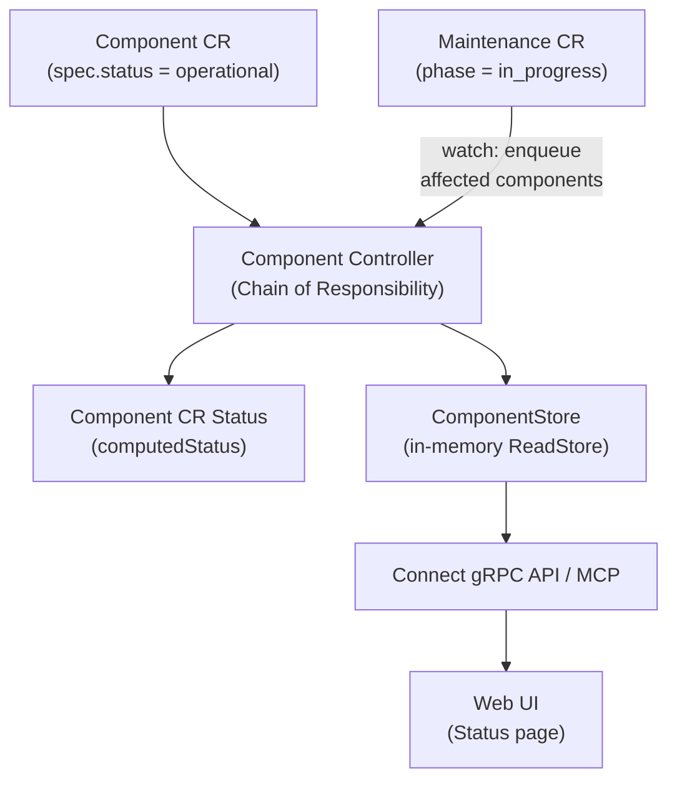
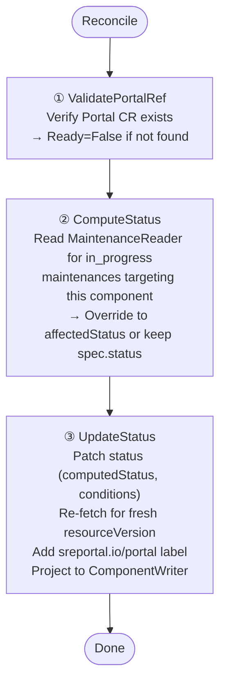

The Component controller computes the effective operational status of each platform component, taking active maintenances into account.

## Overview



## Component Creation

Components can be created in two ways:

- **Manually** via `kubectl apply` or the gRPC API
- **Automatically** from `sreportal.io/component` annotations on K8s source resources (Service, Ingress, Gateway, etc.) or DNS CRs. See the [Annotations]() page for details.

Auto-managed components are labeled with `sreportal.io/managed-by` (`source-controller` or `dns-controller`) and are subject to automatic lifecycle management (sync on reconcile, delete on annotation removal).

## Trigger

**Watch-based**: triggers on create/update/delete of `Component` CRs. Also watches `Maintenance` CRs — when a maintenance changes, all components listed in `spec.components[]` are re-enqueued.

## Chain of Responsibility



### Step 1 — ValidatePortalRef

Looks up the Portal CR by `spec.portalRef`. If not found:
- Sets `Ready` condition to `False` with reason `PortalNotFound`
- Returns error (chain stops, reconciler requeues after 30s)

### Step 2 — ComputeStatus

Reads from the **MaintenanceReader** (in-memory ReadStore, not K8s API) to find `in_progress` maintenances for the same portal. Uses `MaintenanceView.AffectsComponent()` domain method.

```
if any in_progress maintenance targets this component:
    computedStatus = maintenance.spec.affectedStatus  (e.g. "maintenance")
else:
    computedStatus = component.spec.status  (e.g. "operational")
```

### Step 3 — UpdateStatus

1. Detects status transitions (`oldStatus != newStatus`) and updates `lastStatusChange`
2. Sets `Ready=True` condition via shared `statusutil.SetConditionAndPatch()`
3. Re-fetches the CR to get a fresh `resourceVersion` (avoids conflict with the status patch)
4. Adds the `sreportal.io/portal` label
5. Projects `ComponentView` to the `ComponentWriter`

## Domain Types

```
Component CR (spec.status)
     │
     ▼  ComputeStatusHandler (+ MaintenanceReader)
ComputedComponentStatus        (status.computedStatus in etcd)
     │
     ▼
ComponentView                  (ReadStore, in-memory)
     │
     ▼
proto ComponentResource        (on the wire)
```
