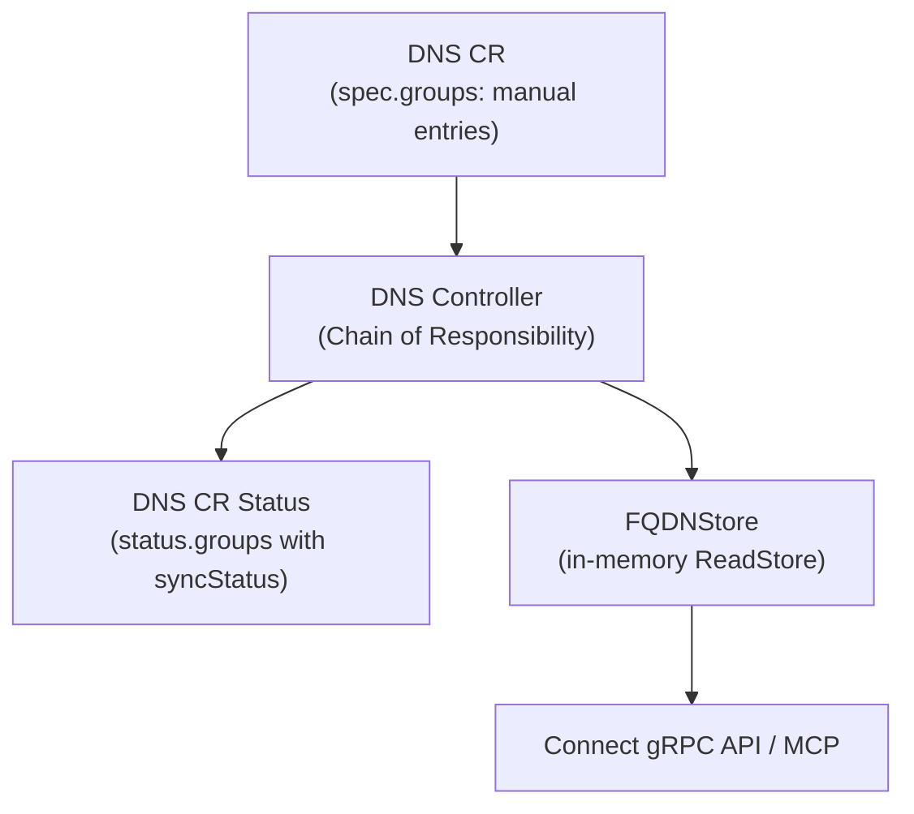
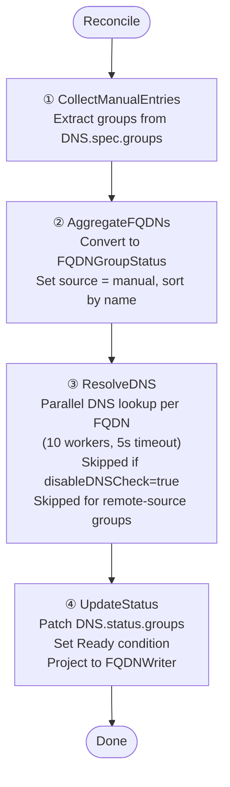

The DNS controller reconciles `DNS` Custom Resources, which contain **manually defined** DNS entry groups. It aggregates manual entries, resolves DNS, and projects the result into the ReadStore.

## Overview

## Trigger

The DNS controller is **watch-based**: it triggers whenever a `DNS` CR is created, updated, or deleted. It requeues every 5 minutes for periodic DNS resolution refresh.

## Chain of Responsibility

### Step 1 — CollectManualEntries

Extracts DNS groups from `DNS.spec.groups`. Each group contains a name and a list of FQDNs with record type, targets, and optional labels.

### Step 2 — AggregateFQDNs

Converts spec groups to `FQDNGroupStatus` objects with `source: manual`. Groups are sorted alphabetically by name for deterministic output.

### Step 3 — ResolveDNS

For each FQDN in the aggregated groups (except those with source `remote`):

| DNS Result | SyncStatus |
|---|---|
| Resolved IPs match targets | `sync` |
| Resolved IPs differ from targets | `notFound` |
| DNS lookup error | `error` |
| Lookup exceeds 5s | `timeout` |

Resolution uses up to 10 concurrent goroutines. This step is skipped entirely when `reconciliation.disableDNSCheck: true` is set in the operator config.

### Step 4 — UpdateStatus

1. Patches `DNS.status.groups` with the resolved data
2. Sets `DNS.status.lastReconcileTime`
3. Sets a `Ready` condition (True on success, False with reason on error)
4. **Projects to ReadStore**: converts status groups to `[]FQDNView` and writes via `fqdnWriter.Replace(key, views)`

On CR deletion, the controller removes the corresponding key from the FQDNWriter.

## ReadStore Projection

Each `FQDNView` from a DNS CR has:
- `Source: "manual"` (distinguishes from external-dns sources)
- `PortalName`: from the DNS CR's `spec.portalRef`
- `Groups`: from the spec group name
- `SyncStatus`: from DNS resolution
