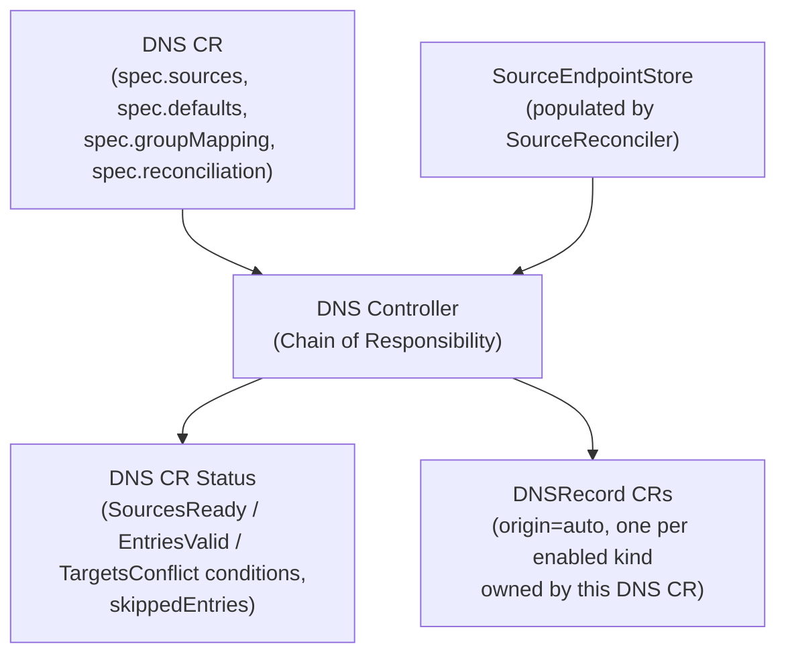
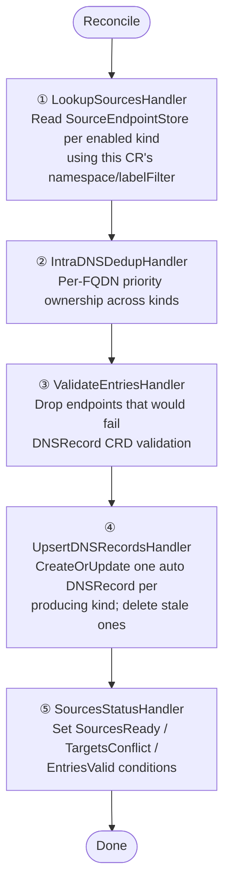

The DNS controller reconciles `DNS` (`sreportal.io/v1alpha2`) custom resources. A `DNS` CR no longer carries manual entries itself — it is a **per-portal discovery configuration + aggregator**: it reads endpoints collected by the global [Source Flow](), deduplicates and validates them, and materialises the result as one or more `DNSRecord` CRs. Manual entries live directly on a `DNSRecord` with `spec.origin: manual` — see the [DNSRecord Controller Flow]().

## Overview

## Trigger

The DNS controller is **watch-based**, `For(&v1alpha2.DNS{})` filtered by `GenerationChangedPredicate` (status-only self-writes don't re-trigger it), plus watches on:

- owned `DNSRecord` CRs (generation changes only — a `DNSRecord`'s own status churn, e.g. `syncStatus`, is ignored)
- `Portal` CRs (any change re-enqueues every `DNS` CR in that portal's namespace referencing it)

It also requeues on `spec.reconciliation.interval` (default `5m`, floor `30s`). `DNS` CRs with `spec.isRemote: true` are skipped entirely — those are owned and synced by the portal controller instead.

## Chain of Responsibility

### Step 1 — LookupSourcesHandler

For each kind enabled in `spec.sources` (in `spec.sources.priority` order, then any remaining enabled kinds in deterministic order), calls `SourceEndpointReader.Lookup(kind, namespace, labelFilter)` against the shared `SourceEndpointStore`, using the effective `(namespace, labelFilter)` computed from that kind's own spec falling back to `spec.defaults`. Results are stored per kind in `ChainData.EndpointsByKind`; kinds whose source hasn't produced a successful collection yet (`Ready(kind)` false — e.g. right after a controller restart, before informers sync) are marked in `ChainData.PreserveKinds` so a later step doesn't treat "not synced yet" as "authoritatively empty."

If no `SourceEndpointReader` is wired at all, the handler fails hard rather than silently clearing every auto FQDN.

### Step 2 — IntraDNSDedupHandler

Enforces `spec.sources.priority` at the **FQDN-name level**, not per record type: the first (highest-priority) kind to produce a given DNS name owns it entirely, and every endpoint for that name from a lower-priority kind — even a different record type — is dropped. A kind that wins a name keeps all record types it produced for that name (e.g. both `A` and `AAAA`). Result goes into `ChainData.KeptEndpointsByKind`.

### Step 3 — ValidateEntriesHandler

Because a single `DNSRecord.spec.entries` write is all-or-nothing at the API server, one endpoint with an invalid FQDN or an unsupported record type would otherwise make the whole `CreateOrUpdate` fail and abandon every valid entry for that source. This handler pre-filters using the exact same constraints as the `DNSRecord` CRD (`domaindns.FQDNPattern`, `domaindns.ValidRecordTypes`):

| Check | Skip reason |
|---|---|
| FQDN fails the DNS name pattern | `invalid_fqdn` |
| Record type not in `A;AAAA;CNAME;TXT` | `invalid_record_type` |

Dropped endpoints are recorded on `ChainData.SkippedEntries`, counted per `(namespace, name, kind, reason)` in the `sreportal_dns_entries_invalid_total` metric, and the surviving count is set on `sreportal_dns_entries_valid`. A kind with any drop this cycle is added to `PreserveKinds` so its last-good `DNSRecord` isn't deleted if filtering happens to leave it with zero valid entries.

### Step 4 — UpsertDNSRecordsHandler

For each kind with at least one kept endpoint: `CreateOrUpdate`s a `DNSRecord` named `{dns-name}-{sourceType}`, owned by the `DNS` CR (`SetControllerReference`), with `spec.origin: auto`, `spec.sourceType: <kind>`, `spec.portalRef` copied from the `DNS` CR, and `spec.entries` built from the endpoints:

- entries are deduplicated by `(FQDN, RecordType)`, each entry's `Targets` deduplicated and sorted, and the whole list sorted by `(FQDN, RecordType)` — deterministic output keeps the write idempotent so a no-op cycle doesn't bump `DNSRecord`'s generation
- `Group` / `Groups` are carried from the `sreportal.io/group` / `sreportal.io/groups` endpoint labels
- `OriginRef` is carried from the external-dns `resource` label (`kind/namespace/name`)

Any existing auto `DNSRecord` owned by this `DNS` CR whose kind no longer produced entries is deleted — **unless** that kind is in `PreserveKinds` (not-yet-synced or all-invalid-this-cycle), in which case the last-good record is left alone.

### Step 5 — SourcesStatusHandler

Sets the DNS CR's status conditions:

| Condition | Meaning |
|---|---|
| `SourcesReady` | `True/Producing` when at least one source kind is enabled; `Unknown/NoSourcesEnabled` when `spec.sources` has nothing enabled. A chain failure upstream is instead surfaced as `False/ReconcileFailed` by the controller's `Reconcile` method. |
| `EntriesValid` | `True/AllValid` when nothing was dropped in step 3; `False/InvalidEntriesSkipped` otherwise, with a bounded (max 100) sample mirrored onto `status.skippedEntries` |
| `TargetsConflict` | `True/FirstWriterWins` when the FQDN read store reports this DNS CR lost a first-writer-wins conflict against another `DNSRecord` producing different targets for the same `(FQDN, recordType)` (cross-portal or cross-DNS-CR collisions, resolved at the read-store projection layer — see `domaindns.FQDNConflictReader`) |

## What this CR does *not* do anymore

Compared to the previous `v1alpha1` DNS controller: there is no manual-entries mode (`spec.groups` is gone — use a manual `DNSRecord` instead), no live DNS resolution in this chain (moved to the async `dnsresolve` runnable, see [DNSRecord Controller Flow]()), and no Component reconciliation (moved to the separate Components Reconciler, see [Component Flow]()).
