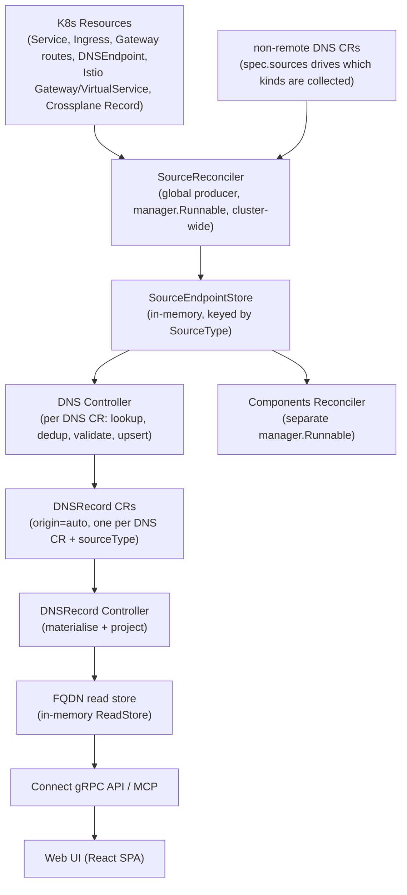
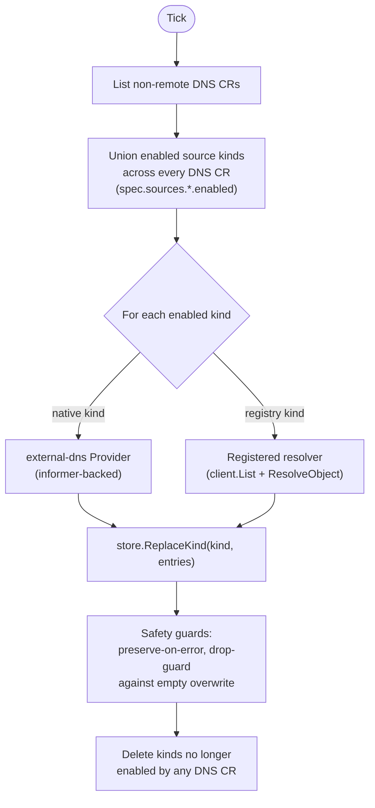

Complete lifecycle of a discovered endpoint (e.g. a Kubernetes Service) from collection to display in the web UI.

## Overview



Two independent `manager.Runnable`s drive discovery today, both ticking on the ConfigMap's `reconciliation.interval` (see [Configuration]()):

- **`SourceReconciler`** — the global producer described on this page. It owns the `SourceEndpointStore` and is the only thing that lists Kubernetes resources for DNS discovery.
- **Components Reconciler** — a separate consumer of the same store that reconciles auto-managed `Component` CRs from `sreportal.io/component*` annotations. See the [Component Flow]().

Neither of these is the old "Source Controller" that used to build `DNSRecord` CRs directly — that responsibility now belongs to the per-portal [DNS Controller]().

## SourceReconciler: the global producer

`SourceReconciler` runs a `Cycle` on every tick:



### Which kinds are collected

Unlike before, **the kind-set to watch is not read from the operator ConfigMap** — it is the union of `spec.sources.<kind>.enabled` across every non-remote `DNS` CR in the cluster. If no `DNS` CR enables `istio-gateway`, the collector never lists Istio Gateways, regardless of what the ConfigMap says.

| Source Type | K8s Resource | Collection path |
|---|---|---|
| `service` | Service | native (external-dns `Provider`) |
| `ingress` | Ingress | native |
| `istio-gateway` | Istio Gateway | native |
| `istio-virtualservice` | Istio VirtualService | native |
| `gateway-httproute` / `gateway-grpcroute` / `gateway-tlsroute` / `gateway-tcproute` / `gateway-udproute` | Gateway API routes | native |
| `dnsendpoint` | external-dns `DNSEndpoint` CRD | native |
| `crossplane-scaleway-record` | Crossplane Scaleway `Record` | registered resolver |

"Native" kinds are discovered through the external-dns source library (`internal/source/externaldns`), using a `kubernetes.Clientset` and an Istio clientset — this recovers the library's full extraction logic (`spec.rules`, `spec.tls`, every Service type, Gateway `servers`) instead of a hand-rolled annotation-only reader. The remaining kinds go through the `registry.Registry` resolver path (`client.List` + a per-kind `ResolveObject`).

### Effective config per kind: union, not per-DNS

For native kinds, the actual collection parameters (namespace scope, `annotationFilter`, `labelFilter`, `fqdnTemplate`, `combineFqdnAndAnnotation`, `ignoreHostnameAnnotation`, plus `service`'s `publishInternal`/`publishHostIP`/`serviceTypeFilter` and route sources' Gateway filters) are computed **once per kind, merged across every DNS CR that enables it** (`externaldns.BuildEffectiveConfigs`). The merge is deliberately permissive:

- namespace scope: cluster-wide if *any* contributor is cluster-wide, otherwise the union of named namespaces
- boolean flags like `publishInternal`: OR'd across contributors
- `ignoreHostnameAnnotation` and friends: only true if *every* contributor sets it (most permissive)
- filters/templates: every distinct non-empty value seen is applied

This guarantees the collector never under-discovers relative to what any single DNS CR asked for. Narrowing back down to what one portal/DNS CR actually wants to see happens later, when the [DNS Controller]()'s `LookupSourcesHandler` reads the store with that CR's own `namespace`/`labelFilter`.

### Safety guards

- **Preserve-on-error**: if `client.List` fails (transient API error) or a CRD isn't installed (`NotFound`/`NoKindMatchError`), the previous cached entries for that kind are left untouched rather than wiped.
- **All-resolved-failed guard**: if every object of a non-empty list fails `ResolveObject`, the previous state is preserved instead of collapsing to empty (protects against a resolver wired to the wrong type).
- **Drop-guard (native path)**: a fresh empty collection is refused when the store already holds entries for that kind — logged and counted via `sreportal_source_drop_guard_triggered_total` rather than silently wiping good data (guards against a transient informer hiccup).
- **Cleanup**: a kind that no `DNS` CR enables anymore is deleted from the store, and its native informer (if any) is stopped via `provider.Forget(kind)`.

### Enrichment

Every resolved endpoint gets the external-dns `resource` label (`kind/namespace/name`) filled in if the resolver didn't already set one, and has its `sreportal.io/*` annotations folded onto its labels via the shared enrichment helper (`adapter.EnrichEndpointLabels`) — see [Annotations](). On the auto-discovery path, only `sreportal.io/groups` is consumed downstream (it survives into `DNSRecordEntry.Groups` for UI grouping); the component-related annotations are read separately by the Components Reconciler from the same store.

## From the store to the UI

Once the DNS Controller upserts a `DNSRecord`, the [DNSRecord Controller]() picks it up (watch-based) and:

1. Materialises `spec.entries` into `status.endpoints`
2. Projects to the FQDN read store as `FQDNView` objects (group mapping applied)
3. A separate async runnable resolves live DNS and patches `syncStatus` onto the record (see [Configuration → DNS resolution]())
4. The gRPC API and MCP server read from the read store; the web UI fetches via Connect protocol and displays FQDNs grouped by category with sync status indicators

## Type Transformations

```
K8s Service / Ingress / Gateway route / DNSEndpoint / Crossplane Record
     │
     ▼  SourceReconciler.Cycle → store.ReplaceKind()
[]domainsource.EnrichedEndpoint    (SourceEndpointStore, in-memory)
     │
     ▼  DNS controller: LookupSources → IntraDNSDedup → ValidateEntries → UpsertDNSRecords
sreportalv1alpha2.DNSRecord        (K8s CR, spec.entries, origin=auto)
     │
     ▼  DNSRecord controller: MaterialiseEntries
DNSRecord.status.endpoints[]
     │
     ▼  DNSRecordToFQDNViews()
[]domaindns.FQDNView               (read model, in-memory)
     │
     ▼  fqdnViewToProto()
[]*sreportal.v1.FQDN               (protobuf, on the wire)
     │
     ▼  dnsApi.ts transform
Fqdn[]                             (TypeScript domain type)
     │
     ▼  groupFqdnsByGroup()
FqdnGroup[]                        (grouped for rendering)
     │
     ▼  React components
JSX / HTML                         (pixels on screen)
```
