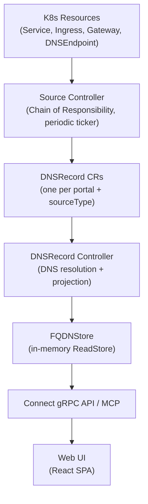
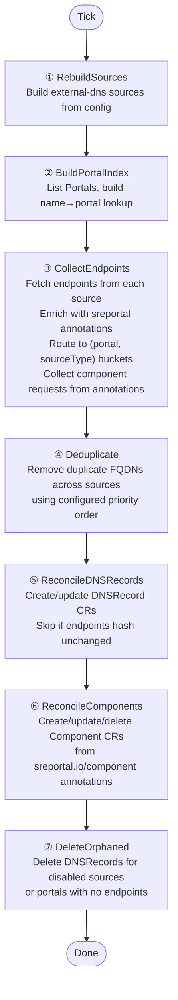

Complete lifecycle of a DNS source (e.g. a Kubernetes Service) from discovery to display in the web UI.

## Overview



## Source Controller Chain

The source controller runs as a `manager.Runnable` with a periodic ticker (configurable interval). On each tick, it executes a Chain of Responsibility with 7 handlers:



### Step 1 — RebuildSources

Ensures typed sources are built from the operator config before collection. Sources are rebuilt lazily: only if no sources exist yet (e.g. first tick or after a CRD becomes available).

| Source Type | K8s Resource | Config Toggle |
|---|---|---|
| `service` | Service | `sources.service.enabled` |
| `ingress` | Ingress | `sources.ingress.enabled` |
| `dnsendpoint` | DNSEndpoint | `sources.dnsEndpoint.enabled` |
| `gateway-httproute` | HTTPRoute | `sources.gatewayHTTPRoute.enabled` |
| `gateway-grpcroute` | GRPCRoute | `sources.gatewayGRPCRoute.enabled` |
| `gateway-tlsroute` | TLSRoute | `sources.gatewayTLSRoute.enabled` |
| `gateway-tcproute` | TCPRoute | `sources.gatewayTCPRoute.enabled` |
| `istio-gateway` | Istio Gateway | `sources.istioGateway.enabled` |
| `istio-virtualservice` | Istio VS | `sources.istioVirtualService.enabled` |
| `crossplane-scaleway-record` | Scaleway Record | `sources.crossplaneScalewayRecord.enabled` |

### Step 2 — BuildPortalIndex

Lists all Portal CRs and builds a lookup index. Identifies the `main` portal (falls back to the first local portal if none has `spec.main: true`). Remote portals are indexed but excluded from local source collection.

### Step 3 — CollectEndpoints

For each enabled source:

1. **Fetch endpoints** via `source.Endpoints(ctx)` → `[]*endpoint.Endpoint` (external-dns canonical type)
2. **Enrich** endpoints with K8s annotations from the original resource:
   - `sreportal.io/portal` → copied to endpoint labels
   - `sreportal.io/groups` → copied to endpoint labels
   - `sreportal.io/ignore` → endpoint will be dropped later
   - `sreportal.io/component` and related → copied to endpoint labels
3. **Route** each endpoint to a `(portalName, sourceType)` bucket:
   - If `sreportal.io/portal` annotation matches a local portal → routed there
   - If annotation is missing or references an unknown/remote portal → falls back to the main portal
4. **Collect component requests** from endpoints annotated with `sreportal.io/component`. Requests are deduplicated by `(portalName, displayName)` — first-seen wins.

**Failure tracking:** Consecutive failures per source type are tracked. After 5 consecutive failures, a `NotReady` condition is set on the corresponding DNSRecord to surface the issue in `kubectl`.

### Step 4 — Deduplicate

When the same FQDN is discovered by multiple sources (e.g. both a Service and an Ingress point to `api.example.com`), the deduplication handler resolves the conflict using the configured `sources.priority` order.

```
config priority: ["dnsendpoint", "ingress", "service"]
                   rank 0         rank 1      rank 2

api.example.com exists in "service" (rank 2)
                    AND in "ingress" (rank 1)

→ ingress wins (rank 1 < rank 2)
→ service loses api.example.com entirely
→ unique FQDNs in service are kept
```

Deduplication is at the **FQDN-name level** (not per record type): the winning source keeps all its record types (A, AAAA, CNAME), while the losing source drops all records for that hostname. Different portals are fully independent.

Sources not listed in `priority` receive the lowest rank and lose to any listed source on conflict.

### Step 5 — ReconcileDNSRecords

For each `(portal, sourceType)` pair with endpoints:

1. **Create or update** a DNSRecord CR named `{portalName}-{sourceType}`
2. **Compute SHA-256 hash** of the endpoint data (order-independent, excludes volatile fields like TTL)
3. **Compare hash** with `status.endpointsHash`:
   - **Same** → skip the status update entirely (no API write)
   - **Different** → update `status.endpoints`, `status.endpointsHash`, `status.lastReconcileTime`, and set a `Ready` condition

The hash comparison happens inside a retry loop to handle cache-lag on newly created resources and conflict errors.

### Step 6 — ReconcileComponents

For each component request collected in step 3:

1. **Skip** if the portal's status page feature is disabled
2. **Create or update** a Component CR named using a deterministic hash of `(portalRef, displayName)`
3. **Sync metadata** from annotations: `displayName`, `group`, `description`, `link` are always updated
4. **Preserve `spec.status`**: if the component already exists, its status is never overwritten (respects manual user changes)
5. **Label** auto-created components with `sreportal.io/managed-by: source-controller`
6. **Delete orphans**: auto-managed components whose `(portal, displayName)` no longer appears in the requests are hard-deleted. Manually created components (without the `managed-by` label) are never touched.

See the [Annotations]() page for the full list of `sreportal.io/component-*` annotations.

### Step 7 — DeleteOrphaned

For each local portal, lists its DNSRecords via the `spec.portalRef` field index. Deletes records whose source type is no longer enabled in config or has no active endpoints.

## DNSRecord → ReadStore → UI

Once a DNSRecord is created or updated, the **DNSRecord controller** picks it up (watch-based) and:

1. **Resolves DNS** for each endpoint (parallel, 10 workers, 5s timeout per FQDN)
2. **Projects to ReadStore** as `FQDNView` objects with sync status and group mapping
3. The **gRPC API** and **MCP server** read from the ReadStore
4. The **Web UI** fetches via Connect protocol and displays FQDNs grouped by category with sync status indicators

See the [DNSRecord Controller Flow]() for details on steps 1-2.

## Type Transformations

```
K8s Service / Ingress / Gateway / DNSEndpoint
     │
     ▼  source.Endpoints()
[]*endpoint.Endpoint              (external-dns)
     │
     ▼  ReconcileDNSRecordsHandler
sreportalv1alpha1.DNSRecord       (K8s CR in etcd)
     │
     ▼  dnsRecordToFQDNViews()
[]domaindns.FQDNView              (read model, in-memory)
     │
     ▼  fqdnViewToProto()
[]*sreportal.v1.FQDN              (protobuf, on the wire)
     │
     ▼  dnsApi.ts transform
Fqdn[]                            (TypeScript domain type)
     │
     ▼  groupFqdnsByGroup()
FqdnGroup[]                       (grouped for rendering)
     │
     ▼  React components
JSX / HTML                        (pixels on screen)
```
