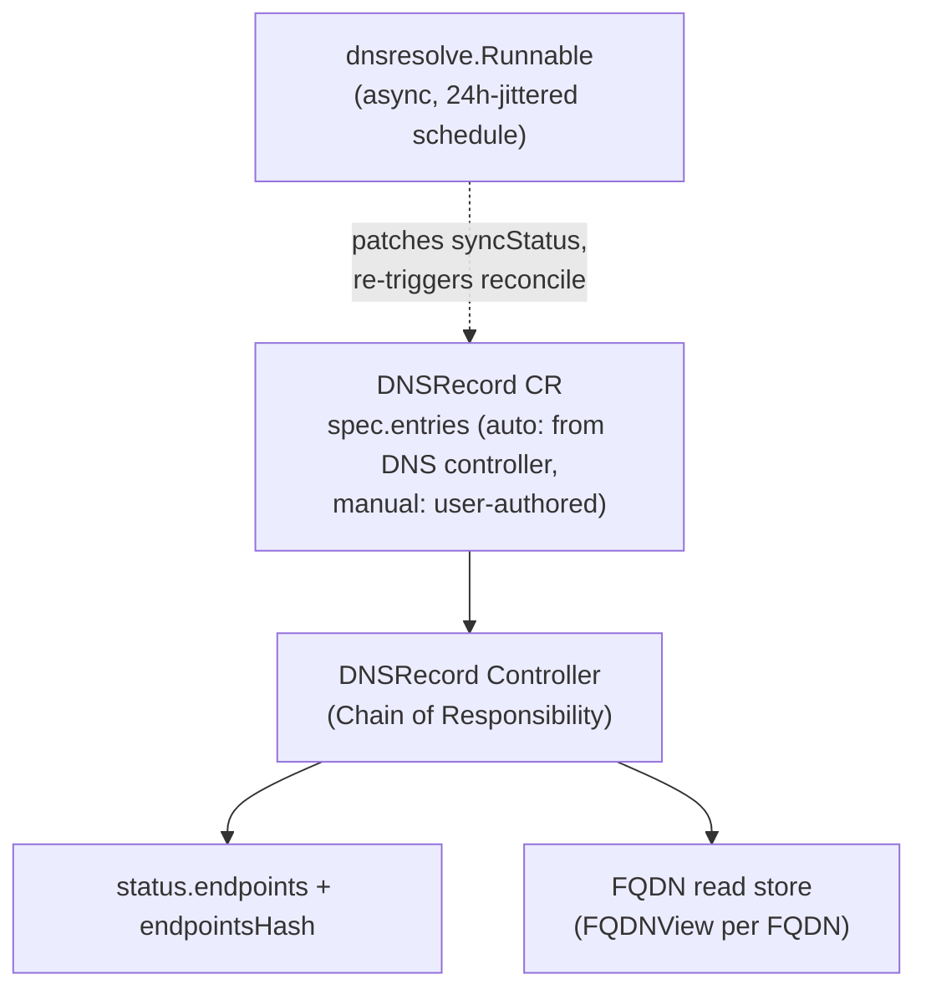
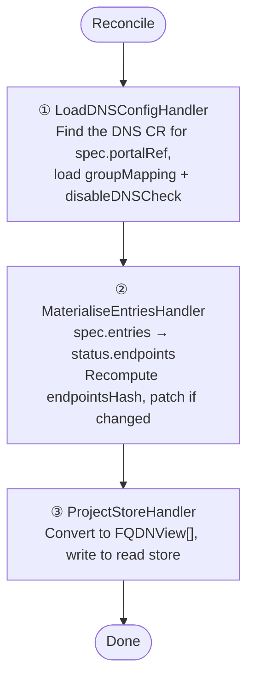

The `DNSRecord` controller reconciles `DNSRecord` (`sreportal.io/v1alpha2`) resources — both `origin: auto` records created by the [DNS Controller]() and `origin: manual` records authored directly by a user. It materialises `spec.entries` into `status.endpoints` and projects the result into the FQDN read store for the gRPC API, MCP, and web UI. **Live DNS resolution is not part of this reconcile** — a separate async runnable owns it (see below).

## Overview



## Trigger

**Watch-based**, `For(&v1alpha2.DNSRecord{})` filtered by `predicate.Or(GenerationChangedPredicate, syncStatusChangedPredicate)`:

- a `spec.entries` change bumps the generation and re-triggers normally
- an async `syncStatus` patch from the `dnsresolve` runnable does **not** bump generation, so a dedicated predicate compares `status.endpoints[].SyncStatus` (keyed by `DNSName|RecordType`, order-independent) between old and new objects and re-enqueues on a real change — this is what makes the resolver's patch actually reach `ProjectStoreHandler`

Also watches:
- `Portal` (DNS feature toggle) — re-enqueues that portal's `DNSRecord`s when the feature turns on
- `DNS` (config changes) — re-enqueues `DNSRecord`s referencing the same `spec.portalRef`

At the end of every reconcile the controller sets `RequeueAfter: 1h` (`DNSRecordResolveInterval`) if the chain didn't already request a sooner one — since spec changes are otherwise sparse, this keeps a periodic re-check going.

### Early exits before the chain runs

`Reconcile` handles a few cases inline, before the chain executes, each dropping the record's contribution from the read store without requeuing:

- `DNSRecord` not found (deleted) → delete its read-store entry
- `spec.portalRef` points at a Portal that doesn't exist → delete from read store, no requeue
- the referenced Portal has the DNS feature disabled → skip silently (cleanup is the portal controller's job)
- no `DNS` CR exists yet for `spec.portalRef` → delete from read store (an orphaned auto record whose parent `DNS` was deleted)

## Chain of Responsibility



### Step 1 — LoadDNSConfigHandler

Lists `DNS` CRs in the record's namespace matching `spec.portalRef` via the `spec.portalRef` field index (a Portal may be referenced by several `DNS` CRs — N:1 is allowed). Picks one deterministically: prefer the owning `DNS` (via the record's controller `ownerRef`, for auto records) else the lexicographically-lowest name — so an unchanged record always resolves the same config and its projected group never flaps between reconciles. Copies `GroupMapping` and `Reconciliation.DisableDNSCheck` into `ChainData`.

If no matching `DNS` CR exists, the chain short-circuits (`reconciler.ErrShortCircuit`) without running the remaining steps — the `DNS` watch above re-enqueues once a matching CR appears.

A companion function, `DNSCheckDisabled`, runs the same DNS-selection logic outside the chain — it's what the async `dnsresolve` runnable calls to decide whether to skip a record.

### Step 2 — MaterialiseEntriesHandler

Converts `spec.entries` into `status.endpoints`, origin-agnostic (works identically for `auto` and `manual`):

- each entry's `Group`/`Groups`/`OriginRef` are re-injected as endpoint labels (`sreportal.io/group`, the multi-group annotation, and the external-dns `resource` label) so the read-side group mapping and origin display keep working after the entries→status hop
- **`SyncStatus` is preserved** per `(DNSName, RecordType)` from the previous `status.endpoints` — this step never resolves DNS itself, so rebuilding endpoints must not blank a status the async resolver already set
- recomputes `status.endpointsHash` (empty string when there are no endpoints) and stamps `status.lastReconcileTime`
- patches the status subresource only when the hash or `observedGeneration` actually changed, so downstream steps can safely re-run without extra API writes

### Step 3 — ProjectStoreHandler

Converts `status.endpoints` into `[]domaindns.FQDNView` (`DNSRecordToFQDNViews`) and writes them to the FQDN read store keyed by `"namespace/dnsrecord-name"`:

```
DNSRecord.status.endpoints[i]  →  FQDNView {
    Name:        endpoint.dnsName
    Source:      "manual" (origin=manual) | "external-dns" (origin=auto)
    SourceType:  DNSRecord.spec.sourceType  (e.g. "service", "ingress"; empty for manual)
    RecordType:  endpoint.recordType
    Targets:     endpoint.targets
    SyncStatus:  endpoint.syncStatus
    Groups:      [computed from the DNS CR's groupMapping]
    Portals:     [DNSRecord.spec.portalRef]
    OriginRef:   parsed from the origin resource label, when present
}
```

If the record has an owning `DNS` CR, the read store is annotated with that owner so conflict reporting (`TargetsConflict`, see [DNS Controller Flow]()) can be scoped to it.

## The async DNS resolver

A separate `manager.Runnable` (`internal/controller/dnsresolve`) is the **only** component that performs live DNS lookups; it never touches the read store directly — projecting is always the `DNSRecord` reconcile's job, so there's a single writer.

- Every tracked `(record, FQDN, recordType)` key gets a next-check time jittered uniformly across the 24h resolution interval when first seen, so checks spread out instead of firing in bursts (including right after a restart)
- A scheduler tick runs every minute and resolves whatever is due, up to 10 concurrent lookups (2s timeout each)
- `spec.reconciliation.disableDNSCheck` on the governing `DNS` CR (resolved via the same `LoadDNSConfigHandler` logic, exposed as `DNSCheckDisabled`) makes a record's keys get rescheduled without being resolved
- `Force(recordKey)` marks a record's keys immediately due and wakes the loop after a short (5s) debounce — the `DNSRecordReconciler` calls this at the end of every successful chain run, so a freshly materialised or edited record gets its first `syncStatus` quickly instead of waiting up to 24h. If the endpoints haven't materialised yet (cache lag), the force request is retained and retried
- Resolution result per FQDN: `sync` (resolved, matches expected targets), `notsync` (resolved, different targets/type), `notavailable` (lookup failed / NXDOMAIN / timeout — the underlying error is logged but collapsed to one status)
- Writes go straight to `DNSRecord.status.endpoints[].syncStatus` via a status patch; a real change is picked up by the `syncStatusChangedPredicate` watch above, re-triggering `ProjectStoreHandler` to push the new status into the read store

## Metrics

- `sreportal_dns_fqdns_total{portal, source}` — number of endpoints projected per `DNSRecord`, keyed by `spec.portalRef` and `spec.origin` (falls back to `"external-dns"` label when origin is unset)
