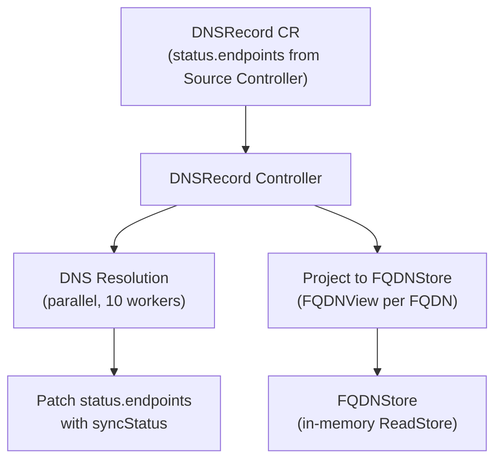
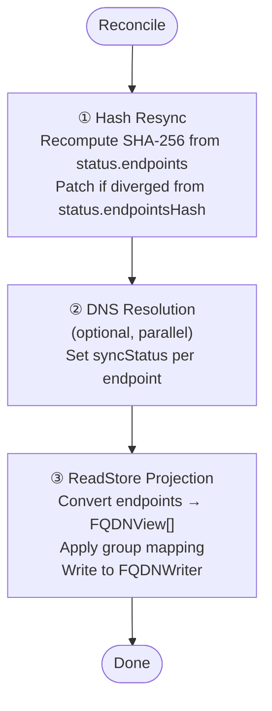

The DNSRecord controller reconciles `DNSRecord` CRs created by the [Source Controller](). It resolves DNS for each endpoint and projects the results into the ReadStore for the gRPC API and web UI.

## Overview



## Trigger

**Watch-based**: triggers on create/update/delete of `DNSRecord` CRs. No explicit requeue — re-triggered when the Source Controller updates the CR on the next tick.

## Reconciliation Steps



### Step 1 — Hash Resync

If `status.endpoints` is non-empty, the controller recomputes the SHA-256 hash from the endpoint data. If it differs from `status.endpointsHash` (e.g. after a manual `kubectl edit`), the hash is patched to the correct value. This prevents the Source Controller from skipping a legitimate update on the next tick.

### Step 2 — DNS Resolution

For each endpoint in `status.endpoints` (skipped if `disableDNSCheck: true` or no resolver):

1. Spawn up to 10 concurrent goroutines
2. Each goroutine calls `domaindns.CheckFQDN(fqdn, recordType)` with a 5-second timeout
3. Compare resolved addresses against expected targets

| DNS Result | SyncStatus |
|---|---|
| Resolved addresses match targets | `sync` |
| Resolved addresses differ | `notsync` |
| DNS lookup fails | `notavailable` |

After resolution, `status.endpoints` is patched with the updated `syncStatus` values.

### Step 3 — ReadStore Projection

Converts each endpoint into a `FQDNView` domain object:

```
DNSRecord.status.endpoints[i]  →  FQDNView {
    Name:       endpoint.dnsName
    Source:     "external-dns"
    SourceType: DNSRecord.spec.sourceType  (e.g. "service", "ingress")
    RecordType: endpoint.recordType
    Targets:    endpoint.targets
    SyncStatus: endpoint.syncStatus
    Groups:     [computed from groupMapping config]
    PortalName: DNSRecord.spec.portalRef
}
```

**Group mapping** applies rules from the operator config:
- `groupMapping.byNamespace`: maps the endpoint's originating namespace to a group name
- `groupMapping.labelKey`: uses a specific label value as the group
- `groupMapping.defaultGroup`: fallback group name

The resulting `[]FQDNView` is written to the FQDNWriter with key `"namespace/dnsrecord-name"`.

On CR deletion, the controller removes the corresponding key from the FQDNWriter.

## Metrics

- `sreportal_dns_fqdns_total` (by portal, source type): number of FQDNs projected per DNSRecord
