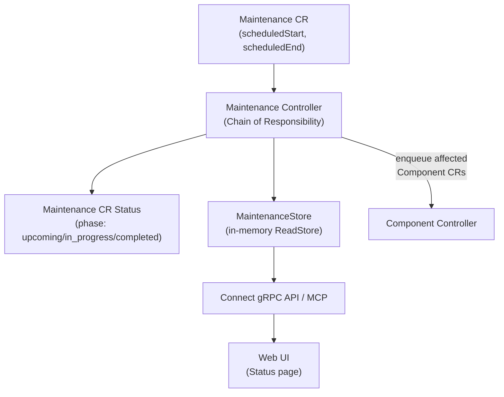
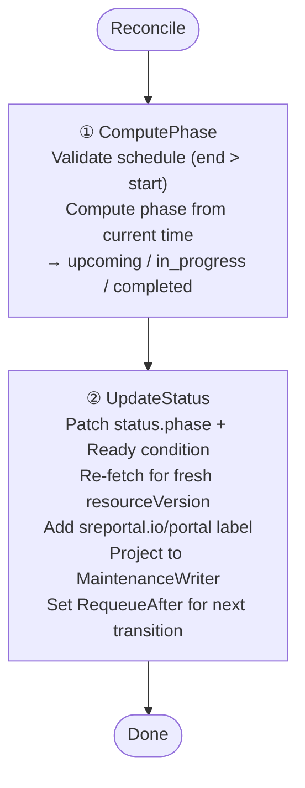
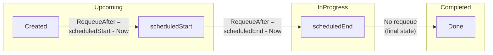

The Maintenance controller computes the lifecycle phase of each maintenance window and triggers automatic phase transitions using strategic requeue timing.

## Overview



## Trigger

**Watch-based**: triggers on create/update/delete of `Maintenance` CRs. No fixed polling interval — the controller uses strategic `RequeueAfter` to wake up exactly when the phase transitions.

## Chain of Responsibility



### Step 1 — ComputePhase

Uses the domain function `maintenance.ComputePhase(now, scheduledStart, scheduledEnd)`:

```
Now < scheduledStart              → upcoming
scheduledStart ≤ Now ≤ scheduledEnd → in_progress
Now > scheduledEnd                → completed
```

**Validation**: if `scheduledEnd ≤ scheduledStart`, the handler returns `ErrInvalidSchedule` and the chain stops.

### Step 2 — UpdateStatus

1. Patches `status.phase` and `Ready=True` condition via `statusutil.SetConditionAndPatch()`
2. Re-fetches the CR for a fresh `resourceVersion`
3. Adds `sreportal.io/portal` label
4. Projects `MaintenanceView` to the `MaintenanceWriter`
5. Computes and sets `RequeueAfter` for the next phase transition

## Strategic RequeueAfter

Instead of polling at a fixed interval, the controller computes the exact duration until the next phase change using the domain function `maintenance.ComputeRequeue()`:



| Current Phase | RequeueAfter | Purpose |
|---------------|-------------|---------|
| `upcoming` | `scheduledStart - Now` | Transition to `in_progress` |
| `in_progress` | `scheduledEnd - Now` | Transition to `completed` |
| `completed` | `0` (no requeue) | Terminal state |

This ensures zero-delay transitions with no wasted reconciliations.

## Impact on Components

When a Maintenance CR changes, the **Component controller** is also triggered:
- The `ComponentReconciler` watches Maintenance CRs via `handler.EnqueueRequestsFromMapFunc`
- Each component listed in `maintenance.spec.components[]` is re-enqueued
- The Component controller reads from the `MaintenanceReader` to check if the component is under active maintenance
- If yes, `computedStatus` is overridden to `maintenance.spec.affectedStatus`

## Domain Types

```
Maintenance CR (spec.scheduledStart, scheduledEnd)
     │
     ▼  ComputePhase(now, start, end) → MaintenancePhase
MaintenancePhase               (status.phase in etcd)
     │
     ▼
MaintenanceView                (ReadStore, in-memory)
     │
     ▼
proto MaintenanceResource      (on the wire)
```
