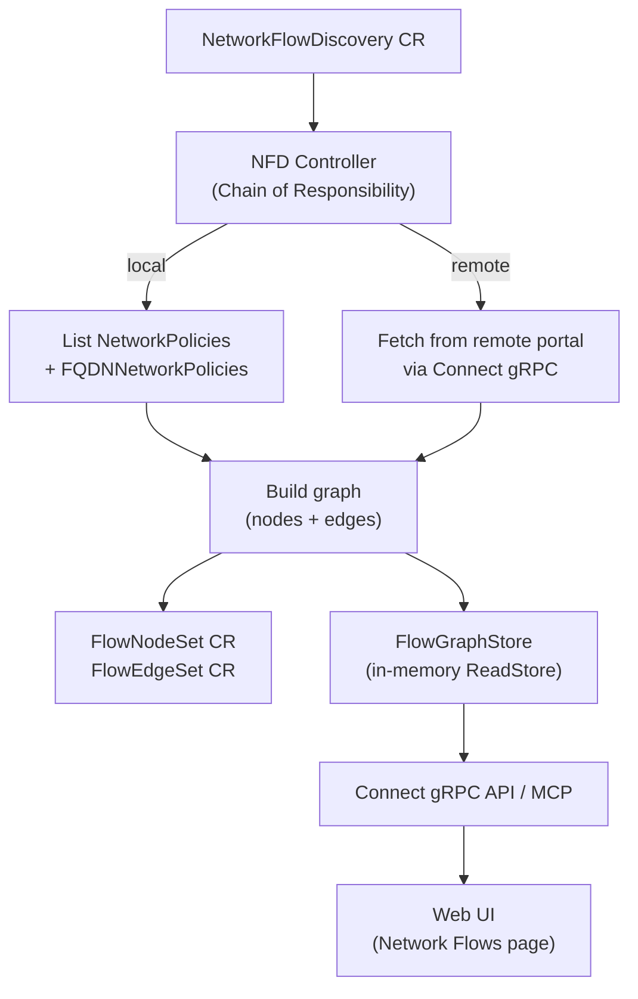
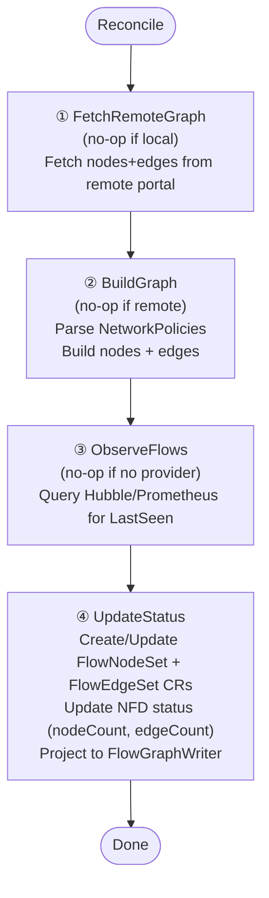

The Network Flow Discovery controller builds a service-to-service dependency graph by reading Kubernetes NetworkPolicies and GKE FQDNNetworkPolicies.

## Overview

## Trigger

**Watch-based**: triggers on create/update/delete of `NetworkFlowDiscovery` CRs. Requeues every **1 minute** for periodic refresh.

## Chain of Responsibility

### Step 1 — FetchRemoteGraph (remote only)

For NFDs with `spec.isRemote: true`:
1. Look up the Portal CR to get the remote URL and TLS config
2. Use a cached TLS client to call the remote portal's Connect API
3. Populate `ChainData.Nodes` and `ChainData.Edges` from the remote response

### Step 2 — BuildGraph (local only)

For local NFDs:

1. **List NetworkPolicies** in the configured namespaces (or all namespaces if `spec.namespaces` is empty)
2. **List FQDNNetworkPolicies** (GKE-specific CRD, silently skipped if not available)
3. **Parse policies** and extract:
   - **App names** from policy naming conventions (strips suffixes like `-ingress-policy`, `-egress-policy`, `-fqdn-network-policy`)
   - **Nodes** classified by type:

| Node Type | Source |
|---|---|
| `service` | Apps referenced in ingress `from` selectors |
| `cron` | Apps with cron-related naming patterns |
| `database` | FQDN targets matching database patterns |
| `messaging` | FQDN targets matching messaging patterns |
| `external` | Other FQDN egress targets |

4. **Build edges** between nodes:

| Edge Type | Description |
|---|---|
| `internal` | Same namespace communication |
| `cross-ns` | Cross-namespace communication |
| `cron` | CronJob to service communication |
| `database` | Service to database |
| `messaging` | Service to message broker |
| `external` | Service to external FQDN |

5. **Deduplicate** edges and sort nodes (by group, then label) and edges (by from, then to)

### Step 3 — ObserveFlows (optional)

Enriches edges with `lastSeen` timestamps from a flow observation provider:

1. **No-op** if no `FlowObserver` is configured or if the resource is remote
2. **Load previous timestamps** from the existing FlowEdgeSet CR to carry them forward
3. **Filter stale edges** — only query edges whose `lastSeen` is nil or older than 1 hour
4. **Query provider** (Hubble gRPC or Prometheus) for the filtered edges
5. **Merge timestamps** into `ChainData.Edges`

If the query fails, the handler logs a warning and continues without failing the chain.

### Step 4 — UpdateStatus

1. **Create/Update FlowNodeSet** CR (name: `{nfdName}-nodes`, owner: NFD)
2. **Create/Update FlowEdgeSet** CR (name: `{nfdName}-edges`, owner: NFD)
3. **Update NFD status**: nodeCount, edgeCount, lastReconcileTime, Ready condition
4. **Project to ReadStore**: write nodes and edges to FlowGraphWriter (keyed by NFD name + portal ref)

## Child CR Lifecycle

Both `FlowNodeSet` and `FlowEdgeSet` CRs have owner references to the parent `NetworkFlowDiscovery`. Deleting the NFD automatically cleans up the node and edge sets.

## MCP Tools

| Tool | Description |
|---|---|
| `list_network_flows` | List nodes and edges with optional portal/namespace/search filters (1-hop expansion) |
| `get_service_flows` | Get all incoming and outgoing flows for a specific service |
