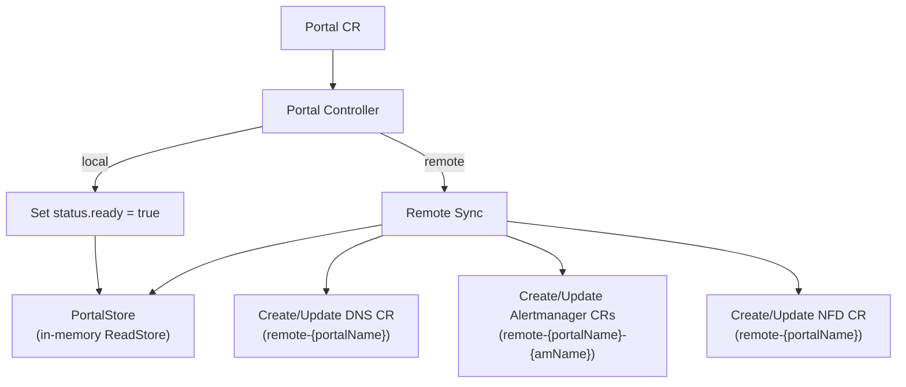
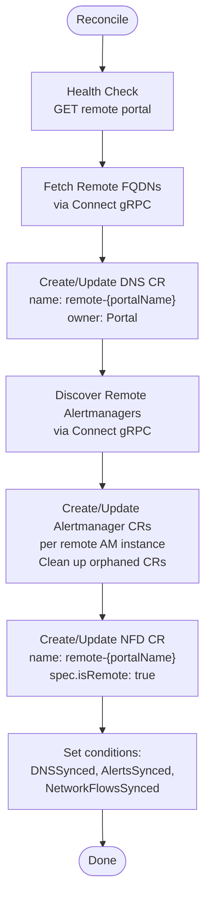

The Portal controller manages portal status and orchestrates remote portal synchronization. Remote portals create child CRs (DNS, Alertmanager, NetworkFlowDiscovery) that are reconciled by their respective controllers.

## Overview

## Trigger

**Watch-based**: triggers on create/update/delete of `Portal` CRs. Remote portals requeue every **5 minutes** for periodic sync.

## Local Portal

For portals without `spec.remote`:

1. Set `status.ready = true`
2. Clear any `RemoteSync` status fields
3. Set `Ready` condition
4. Project to PortalWriter as `PortalView`

## Remote Portal

For portals with `spec.remote` (URL pointing to another SRE Portal instance):

### Remote DNS Sync

Creates a `DNS` CR named `remote-{portalName}` with groups fetched from the remote portal. This triggers the DNS controller to project the remote FQDNs into the FQDNStore with `source: remote`.

### Remote Alertmanager Sync

Discovers alertmanager instances on the remote portal, then for each:
- Creates an `Alertmanager` CR named `remote-{portalName}-{amName}`
- Labels it with `sreportal.io/remote-alertmanager-name`
- Sets owner reference to the Portal for garbage collection

Orphaned Alertmanager CRs (whose remote name no longer exists) are automatically deleted.

### Remote Network Flow Sync

Creates a `NetworkFlowDiscovery` CR named `remote-{portalName}` with `spec.isRemote: true` and `spec.remoteURL` pointing to the remote portal. This triggers the NFD controller to fetch network flows from the remote instance.

## EnsureMainPortal Runnable

At startup, a `manager.Runnable` ensures a main portal exists:

1. Wait for cache sync
2. List all Portal CRs
3. If no portal has `spec.main: true`, create one with name `main`, title `Main Portal`

## Child CR Lifecycle

All child CRs created by the portal controller have **owner references** pointing to the parent Portal. When a portal is deleted, Kubernetes garbage collection automatically deletes all child DNS, Alertmanager, and NetworkFlowDiscovery CRs.

## Metrics

- `sreportal_portals_total` (by local/remote): number of portals
- `sreportal_portal_remote_sync_errors_total`: counter of remote sync failures
- `sreportal_portal_remote_fqdns_synced`: gauge of FQDNs synced from remote
