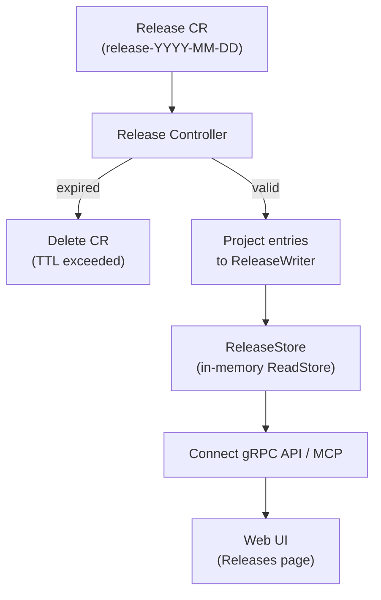
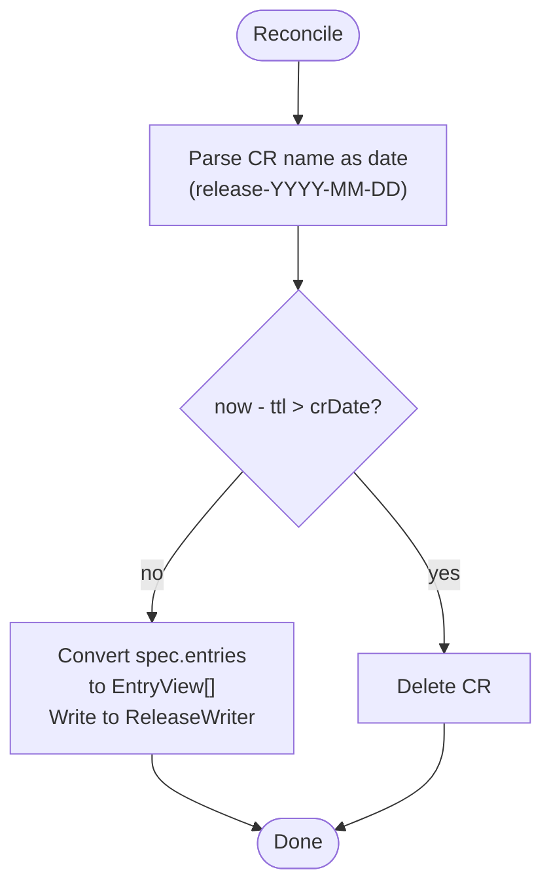

The Release controller watches `Release` CRs (daily release event logs) and performs ReadStore projection with automatic TTL-based cleanup.

## Overview



## Trigger

**Watch-based**: triggers on create/update/delete of `Release` CRs. Requeues every **12 hours** to re-check TTL expiration.

## Reconciliation Steps



### TTL Cleanup

Each Release CR is named `release-YYYY-MM-DD`. The controller parses the date from the name and compares it against the configured TTL (default: 30 days). Expired CRs are automatically deleted.

### ReadStore Projection

For valid CRs, each `spec.entries[i]` is converted to a `domainrelease.EntryView`:

```
ReleaseEntry {             →  EntryView {
    Type: "deployment"            Type: "deployment"
    Version: "v1.2.3"            Version: "v1.2.3"
    Origin: "argocd"             Origin: "argocd"
    Date: "2026-03-25T10:00Z"    Date: 2026-03-25T10:00:00Z
    Author: "deploy-bot"         Author: "deploy-bot"
    Message: "Fix login bug"     Message: "Fix login bug"
    Link: "https://..."          Link: "https://..."
}                          }
```

Written to the ReleaseWriter with key `YYYY-MM-DD`. On CR deletion, the corresponding key is removed.

## Creating Releases

Releases are created via the `AddRelease` gRPC RPC (or `kubectl apply`). The RPC:

1. Validates the release type against the configured allowlist (`release.types` in operator config)
2. Gets or creates the `release-YYYY-MM-DD` CR for today
3. Appends the entry to `spec.entries`

## API

| RPC | Description |
|---|---|
| `AddRelease` | Append a release entry to today's CR |
| `ListReleases` | List entries for a specific day with pagination |
| `ListReleaseDays` | Return all days with Release CRs and the TTL window |
