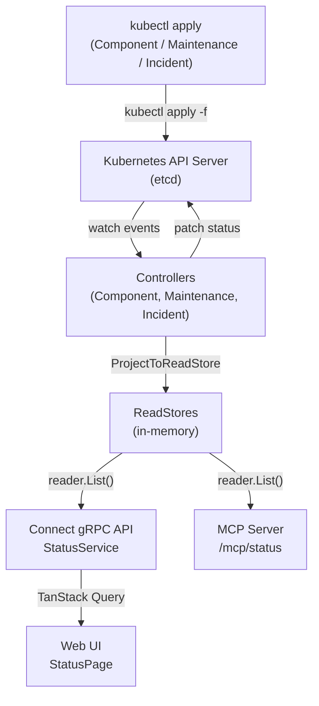

The Status Page feature provides a real-time view of platform health, scheduled maintenances, and declared incidents. All data is stored as Kubernetes CRs — no external database required.

## Overview



## Custom Resources

Three CRDs work together to model the status page:

| CRD | Linked to Portal | Description |
|-----|:-:|-------------|
| **Component** | `spec.portalRef` | A platform service/infrastructure with an operational status |
| **Maintenance** | `spec.portalRef` | A scheduled maintenance window affecting one or more components |
| **Incident** | `spec.portalRef` | A declared incident with a timeline of updates |

### Component

Represents a monitored platform component (e.g., GKE cluster, Cloud SQL, API Gateway).

#### Manual creation

```yaml
apiVersion: sreportal.io/v1alpha1
kind: Component
metadata:
  name: gke-prod
  namespace: sreportal-system
spec:
  displayName: "GKE Production"
  description: "Main Kubernetes cluster"
  group: "Infrastructure"
  portalRef: main
  status: operational
  link: "https://console.cloud.google.com/kubernetes"
```

#### Auto-creation from annotations

Components can also be created automatically by annotating K8s source resources (Service, Ingress, Gateway, etc.) or DNS CRs with `sreportal.io/component`:

```yaml
apiVersion: v1
kind: Service
metadata:
  name: api-server
  annotations:
    external-dns.alpha.kubernetes.io/hostname: "api.example.com"
    sreportal.io/portal: "production"
    sreportal.io/component: "API Gateway"
    sreportal.io/component-group: "Infrastructure"
    sreportal.io/component-description: "Main API ingress"
    sreportal.io/component-link: "https://grafana.internal/d/api"
spec:
  type: LoadBalancer
  ports:
    - port: 443
```

Auto-managed components are labeled `sreportal.io/managed-by` and follow annotation-driven lifecycle: metadata is synced on every reconcile, `spec.status` is never overwritten, and the component is deleted when the annotation is removed. See [Annotations]() for details.

**Key fields:**

| Field | Description |
|-------|-------------|
| `spec.displayName` | Human-readable name shown on the status page |
| `spec.group` | Logical grouping (e.g., "Infrastructure", "Applications", "Data") |
| `spec.status` | Manually declared status: `operational`, `degraded`, `partial_outage`, `major_outage`, `unknown` |
| `spec.link` | Optional external URL (dashboard, console) |
| `status.computedStatus` | Effective status — overridden to `maintenance` when an active maintenance targets this component |

### Maintenance

Represents a scheduled maintenance window. The controller automatically computes the phase (`upcoming` / `in_progress` / `completed`) and requeues at exact transition times.

```yaml
apiVersion: sreportal.io/v1alpha1
kind: Maintenance
metadata:
  name: db-migration-v42
  namespace: sreportal-system
spec:
  title: "Database migration — schema v42"
  description: "PostgreSQL schema migration. ~30s write interruption."
  portalRef: main
  components:
    - cloud-sql-prod
  scheduledStart: "2026-03-28T02:00:00Z"
  scheduledEnd: "2026-03-28T04:00:00Z"
  affectedStatus: maintenance
```

**Phase logic:**

```
Now < scheduledStart              → upcoming
scheduledStart ≤ Now ≤ scheduledEnd → in_progress
Now > scheduledEnd                → completed
```

During `in_progress`, affected components' `computedStatus` is overridden to `spec.affectedStatus`.

### Incident

Represents a declared incident with a chronological timeline. Updates are appended to `spec.updates` via `kubectl edit` or `kubectl patch`.

```yaml
apiVersion: sreportal.io/v1alpha1
kind: Incident
metadata:
  name: api-latency-20260326
  namespace: sreportal-system
spec:
  title: "API latency spike"
  portalRef: main
  severity: major
  components:
    - api-gateway
  updates:
    - timestamp: "2026-03-26T14:30:00Z"
      phase: investigating
      message: "P99 latency increase detected."
    - timestamp: "2026-03-26T15:52:00Z"
      phase: resolved
      message: "Rollback completed. Latency nominal."
```

**Computed fields (in `status`):**

| Field | Description |
|-------|-------------|
| `currentPhase` | Phase of the most recent update (by timestamp) |
| `startedAt` | Timestamp of the first update |
| `resolvedAt` | Timestamp of the first `resolved` update |
| `durationMinutes` | `resolvedAt - startedAt` in minutes |

## Web UI

The status page is accessible at `/:portalName/status` and is organized into three tabs:

### Components

Displays a global status banner (worst status across all components) and a grouped component grid (responsive 1/2/3 columns). Each component shows its computed status, display name, description, and an optional external link.


### Incidents

Active incidents appear on top (expanded by default), resolved incidents below (last 10, collapsible timeline). Each incident shows severity, phase, affected components, and chronological updates.


### Maintenance

Scheduled and ongoing maintenance windows, sorted: in_progress → upcoming → completed (last 5). Each entry shows title, affected components, scheduled time range, and current phase.


## API

### Connect gRPC (StatusService)

| RPC | Description |
|-----|-------------|
| `ListComponents` | List components (filters: `portal_ref`, `group`) |
| `ListMaintenances` | List maintenances (filters: `portal_ref`, `phase`) |
| `ListIncidents` | List incidents (filters: `portal_ref`, `phase`) |

### MCP (`/mcp/status`)

| Tool | Description |
|------|-------------|
| `list_components` | List components with status |
| `list_maintenances` | List maintenance windows |
| `list_incidents` | List incidents |
| `get_platform_status` | Aggregated platform health summary |
